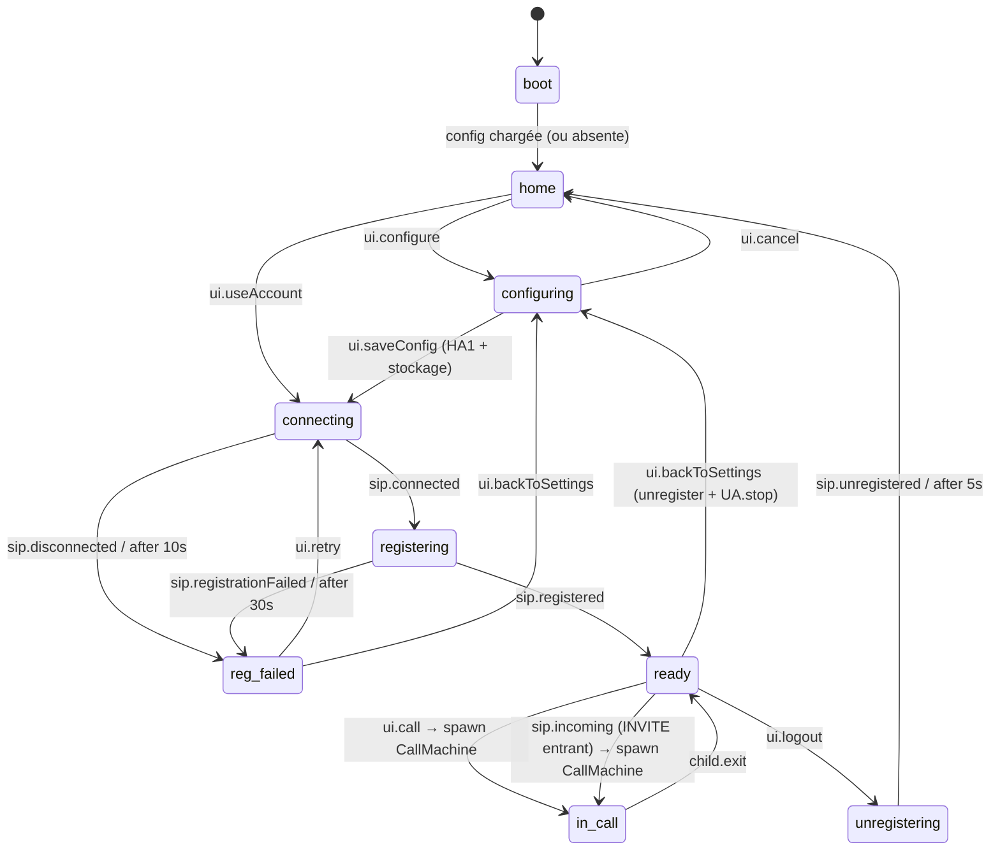
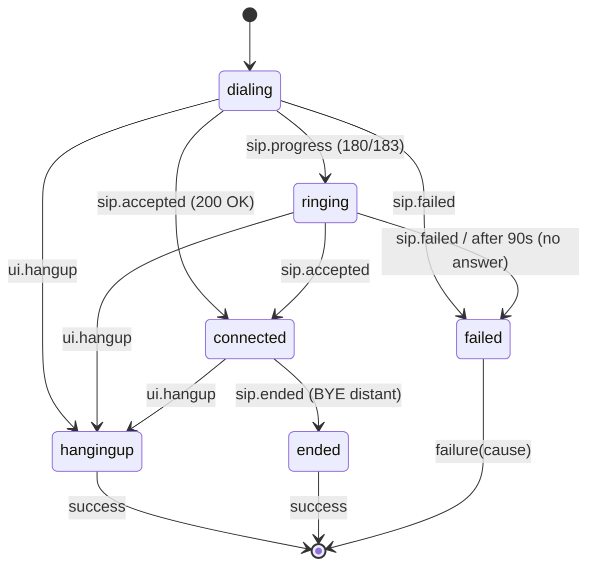
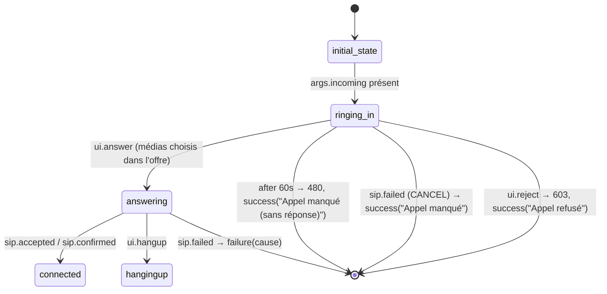

# Conception technique — Trix Communicator

**Statut :** Brouillon — Phase 0
**Dernière mise à jour :** 2026-08-15

## 1. Pile technique

| Couche | Choix | Justification |
|---|---|---|
| Bundler / dev server | **Vite** + TypeScript strict | standard, HMR, build ESM |
| Logique applicative | **finite-state-language** (FSL) v0.1.x | machines à états typées, `toMermaid()`, zéro dépendance, ESM |
| Signalisation SIP | **JsSIP** | SIP over WSS, support `ha1`/`realm` natif, RTCSession |
| UI | **TypeScript vanilla** (DOM direct, rendu piloté par `instance.subscribe()`) | 3 écrans seulement ; évite React ; bundle minimal ; le hook `finite-state-language/react` reste une porte de sortie si l'UI se complexifie |
| Tests | Vitest + fake timers | même outillage que FSL lui-même |

FSL est ESM only et exige des handlers synchrones (l'async passe par `fx.task`/`fx.delay`) —
contrainte structurante assumée : **aucun `await` dans la logique d'états**.

Point de départ recommandé : `fsl-typescript/typescript/test/webphone.test.ts` — un webphone
SIP factice déjà écrit avec FSL (états `registering / ready / calling_out / ringing_in /
connected / call_failed`), à transposer sur JsSIP.

## 2. Architecture

```
┌───────────────────────────────────────────────┐
│ UI (vanilla TS)                               │
│  screens/home  screens/config  screens/call   │
│        │  render(snapshot)        ▲           │
│        ▼                          │subscribe  │
├───────────────────────────────────────────────┤
│ Machines FSL                                  │
│  PhoneMachine ──fx.spawn──► CallMachine (1/appel)
├───────────────┬───────────────────────────────┤
│ sip/binding.ts│ storage/SecureStore           │
│ (JsSIP⇄events)│  browserStore (WebCrypto)     │
│               │  [futur: tauriStore (keyring)]│
├───────────────┴───────────────────────────────┤
│ JsSIP (UA, RTCSession)   │ WebRTC (navigateur)│
└───────────────────────────────────────────────┘
```

Principes :
- **La UI ne parle jamais à JsSIP.** Elle envoie des événements `ui:*` à la machine et re-rend
  sur chaque snapshot (`state` + `context`).
- **JsSIP ne décide de rien.** Le binding (~50 lignes) convertit les callbacks JsSIP en
  événements `sip:*` envoyés à la machine ; les objets `UA` et `RTCSession` vivent dans le
  contexte des machines.
- Grâce à la *selective receive* de FSL (queue `pending` rejouée à chaque changement d'état),
  un événement SIP arrivant pendant une transition (ex. INVITE entrant) n'est pas perdu.

### Arborescence cible

```
src/
  main.ts                 # bootstrap, détection config, start(PhoneMachine)
  machines/
    phone.ts              # PhoneMachine (cycle de vie app + REGISTER)
    call.ts               # CallMachine (une instance par appel)
    events.ts             # types d'événements ui:* / sip:*
  sip/
    binding.ts            # JsSIP → phone.send({type:"sip:..."})
    uri.ts                # normalisation adresse (ajout @domaine, sip:)
  storage/
    store.ts              # interface SecureStore + implé navigateur
    ha1.ts                # MD5(username:realm:password)
  ui/
    screens/{home,config,call}.ts
    theme.ts              # tokens FSL clair/sombre
  debug/
    observability.ts      # export toMermaid(), logger de transitions
```

## 3. Conventions d'événements

- `ui:*` — actions utilisateur : `ui:configure`, `ui:saveConfig`, `ui:useAccount`,
  `ui:call {target, video}`, `ui:hangup`, `ui:backToSettings`, `ui:logout`, `ui:retry`,
  `ui:muteMic`, `ui:muteCam`, `ui:answer {video}`, `ui:reject`, `ui:dtmf {tone}` (ph. 4)
- `sip:*` — remontées JsSIP : `sip:connected`, `sip:disconnected`, `sip:registered`,
  `sip:unregistered`, `sip:registrationFailed {cause}`, `sip:newSession {session}`,
  `sip:progress`, `sip:accepted`, `sip:confirmed`, `sip:ended {cause}`, `sip:failed {cause}`
- `task:*` / `child:*` / `parent:*` — mécanique FSL (`fx.task`, sous-machines).

## 4. Machines à états

### 4.1 PhoneMachine (cycle de vie application + enregistrement)



Décisions :
- `boot` (= `initial_state`) : `fx.task(store.load(), "loadConfig")` → pré-remplit le contexte.
- **« Paramètres » et « Déconnexion » désenregistrent et arrêtent l'UA** — pas d'UA vivant
  hors de `ready`/`in_call` : simple, prédictible, re-REGISTER propre à chaque retour.
- L'UA JsSIP est créé dans `enter` de `connecting` et stocké dans le contexte.
- En `ready`, une perte d'enregistrement (`sip:registrationFailed`, `sip:disconnected`)
  renvoie vers `reg_failed` — l'indicateur UI suit l'état de la machine, pas un flag séparé.
- Timers : `after` de FSL (armé à l'entrée, annulé à la sortie).

### 4.2 CallMachine — appel sortant (phase 2)

Une instance par appel, `fx.spawn(CallMachine, { as: "call", args: { session | target, video } })`.
Terminaison par `success()/failure()` → le parent reçoit `child:exit` et revient en `ready`.



- `enter(dialing)` : `ua.call(uri, { mediaConstraints: { audio: true, video } , pcConfig })`.
- En `connected` : `ui:muteMic` / `ui:muteCam` / `ui:muteSelfView` = `stay()` + mutation du
  contexte + action JsSIP (`session.mute()` etc.) — pas de changement d'état.
- Chrono : timestamp de `sip:accepted` en contexte, la UI dérive l'affichage.
- Flux média : `session.connection` (RTCPeerConnection) → attach `remoteVideo`/`localVideo`.

### 4.3 CallMachine — appel entrant (phase 3)

Même machine : `initial_state` est un aiguillage traversé sans attendre d'événement,
vers `dialing` (sortant) ou `ringing_in` (entrant, `args.incoming` injecté par le parent).
Une fois l'appel établi, les deux sens partagent le même état `connected` — mutes,
chrono, vu-mètres et raccrochage sont écrits une seule fois.



Un appel entrant non décroché n'est **pas** un échec : la machine sort en `success` avec
le motif exact, que `PhoneMachine` consigne en `missed` dans l'historique (« Appel refusé »
vs « Appel manqué »). Seul un échec après décrochage (média refusé par l'OS, réponse
finale d'erreur) sort en `failure` et s'affiche comme erreur.

Règles de réponse, dérivées de l'offre SDP de l'INVITE (`sip/sdp.ts` : un flux compte
s'il a un port non nul et n'est pas `inactive`) :
- vidéo proposée → boutons « Répondre en vidéo » **et** « Répondre en audio » ;
- audio seul proposé → uniquement « Répondre en audio » ;
- vidéo seule proposée → uniquement « Répondre en vidéo ».

Côté port (`sip/port.ts`), l'INVITE arrive en `sip:incoming` avec un objet `IncomingCall`
— identité, médias proposés, `listen` / `answer(media)` / `reject(reason)`. Les codes SIP
de refus ne vivent que là : `declined` → 603, `busy` → 486, `timeout` → 480.

**Un appel à la fois** : `ready` est le seul état qui accepte un INVITE. En communication
il est refusé occupé (486), partout ailleurs (connexion, reconnexion, veille, échec
d'enregistrement) temporairement indisponible (480).

#### Alerte d'appel entrant (accessibilité — `ui/alert.ts`)

Le public visé étant sourd ou malentendant, la sonnerie est un canal d'appoint : l'alerte
réelle est visuelle. `ui/alert.ts` est le point unique qui démarre et arrête **tous** les
canaux, piloté par le seul état `ringing_in` — aucun canal n'a de cycle de vie propre :

| canal                | couvre le cas où…                                |
|----------------------|--------------------------------------------------|
| flash plein écran    | l'application est à l'écran                       |
| titre d'onglet       | l'application est dans un onglet d'arrière-plan   |
| favicon clignotant   | idem, repérable dans la barre d'onglets           |
| notification système | la fenêtre est masquée ou minimisée               |
| vibration            | téléphone en poche ou posé (Android)              |
| wake lock            | l'écran allait s'éteindre — le flash serait perdu |

Contraintes tenues :
- **photosensibilité** : cadence < 1 Hz, très en deçà des trois flashs par seconde de
  WCAG 2.3.1, et pas de rouge saturé (violet ⇄ vert) ; sous `prefers-reduced-motion`,
  le cadre devient permanent au lieu de clignoter ;
- **lisibilité** : le flash porte sur un cadre périphérique, pas sur un voile plein écran —
  les boutons de réponse restent lisibles et cliquables (`pointer-events: none`) ;
- **permissions** : la notification système n'est demandée que sur clic explicite
  (`Activer les alertes système`), jamais à l'ouverture ;
- **extinction sûre** : `ui/app.ts` coupe l'alerte dès qu'un écran hors appel est rendu —
  l'alerte vit hors de `#app` (flash, titre, notification), elle ne peut donc pas être
  emportée par un simple re-rendu ;
- **réglage utilisateur** : le flash est débrayable par `AccountConfig.flashAlert` (case à
  cocher de l'écran de configuration, active par défaut). Il est stocké **avec le compte**,
  chiffré comme le reste — pas dans les préférences locales (`ui/prefs.ts`, thème et taille
  de texte) : c'est un réglage d'accessibilité de la personne, il doit suivre le compte et
  non le navigateur. Seul le flash est débrayable ; les autres canaux ne perturbent pas
  l'écran et restent le filet de sécurité de l'alerte.

Pour un futur empaquetage Tauri (§8), ces canaux ont des équivalents natifs plus visibles
(notification système native, `requestUserAttention` sur la fenêtre) : `ui/alert.ts` est
l'unique endroit à adapter.

### 4.4 Observabilité (phase 2)

- `npm run diagrams` régénère [DIAGRAMS.md](DIAGRAMS.md) et un test échoue si le fichier
  a divergé du code — la conception et le code ne peuvent pas diverger silencieusement.
- Les diagrammes viennent d'une analyse statique des sources (`test/machine-graph.ts`),
  pas de `Machine.toMermaid()`. À l'exécution, les handlers sont des closures opaques :
  la bibliothèque ne voit que la forme raccourcie `on: { evt: "cible" }`, que ces machines
  n'utilisent jamais. Le source, lui, écrit chaque cible en clair dans `goto("cible")`.
  L'extraction ignore les gardes : elle sur-approxime, jamais l'inverse.
- `start({ debug: true, logger })` : chaque transition loggée au format Elixip
  (`sip:accepted: (calling_out) -> (connected) "200 OK"`), ring buffer `instance.log`
  consultable pour le support.

## 5. Intégration JsSIP

```ts
const socket = new JsSIP.WebSocketInterface(cfg.proxy);      // wss://…
const ua = new JsSIP.UA({
  sockets: [socket],
  uri: `sip:${cfg.username}@${cfg.domain}`,
  display_name: cfg.displayName,
  realm: cfg.domain,          // hypothèse realm = domaine (cf. risque SPECS)
  ha1: cfg.ha1,               // MD5(username:realm:password) — pas de mot de passe
  register: true,
});
```

- Binding : `ua.on("connected"|"disconnected"|"registered"|"unregistered"|
  "registrationFailed"|"newRTCSession", …)` → `phone.send({type:"sip:…", …})` ;
  idem sur chaque `RTCSession` (`progress`, `accepted`, `confirmed`, `ended`, `failed`)
  → `call.send(…)`.
- DTMF (phase 4) : `session.sendDTMF(tone)` (RFC 4733 par défaut).
- Tchat (phase 4) : data channel via `session.connection.createDataChannel("t140")` —
  à concevoir après analyse de `../generique/composants/tchat3`.

## 6. Stockage sécurisé du compte

**Réponse à la question de goals.md (« JS offre-t-il une possibilité de stockage sûr ? ») :**
le navigateur n'offre **pas** de coffre-fort accessible à l'application (pas d'API « wallet »
standard ; la Credential Management API ne stocke que des mots de passe de site, inutilisable
pour des identifiants SIP). La meilleure approximation :

1. **Ne jamais stocker le mot de passe** : à la sauvegarde du formulaire, calcul de
   `ha1 = MD5(username:realm:password)` (MD5 absent de WebCrypto → mini-implémentation locale
   ~150 lignes ou `js-md5`). Le HA1 suffit à JsSIP pour s'authentifier ; sa compromission
   ne révèle pas le mot de passe (mais permet l'usage du compte SIP — d'où le point 2).
2. **Chiffrement au repos** : clé AES-GCM 256 générée par WebCrypto avec
   `extractable: false`, stockée dans IndexedDB (le navigateur la garde dans son profil,
   elle n'est pas exportable par du JS) ; la configuration chiffrée (IV aléatoire par
   écriture) est stockée à côté. Un vol du disque/profil brut ne suffit pas à lire le HA1.
3. **Limite assumée** : tout JS exécuté sur l'origine peut déchiffrer (XSS). Mitigation :
   CSP stricte (`default-src 'self'`), zéro dépendance runtime côté logique (FSL), audit
   des deps.

```ts
interface AccountConfig {
  proxy: string;        // wss://…
  domain: string;
  displayName: string;
  username: string;
  authUsername: string | null; // identifiant d'authentification, si distinct
  ha1: string;          // jamais le mot de passe
  flashAlert: boolean;  // réglage d'accessibilité (§4.3) — suit le compte, pas le navigateur
}
interface SecureStore {
  load(): Promise<AccountConfig | null>;
  save(cfg: AccountConfig): Promise<void>;
  clear(): Promise<void>;
}
```

`SecureStore` est le **point d'abstraction pour Tauri** : une future implémentation
`tauriStore` (trousseau OS via `tauri-plugin-keyring`/stronghold — libsecret/GNOME Keyring
sous Ubuntu) se substituera à `browserStore` par détection de `window.__TAURI__`,
sans toucher au reste du code.

## 7. Normalisation d'adresse

```
saisie sans "@"  →  sip:<saisie>@<domaine configuré>
saisie avec "@"  →  sip:<saisie>
préfixe sip: déjà présent → inchangé
```

Validation minimale (caractères autorisés) avant `ua.call()` ; l'erreur JsSIP reste le
filet de sécurité (`sip:failed {cause}` affichée).

## 8. Compatibilité Tauri (perspective future — contraintes à respecter dès maintenant)

Décision projet (2026-08-15) : **l'intégration Tauri est reportée**. Les phases 1–4 livrent
une app web pure. On garde néanmoins la compatibilité en ligne de mire :

### Contrainte majeure : WebRTC dans la webview Linux

Tauri utilise la webview système : WebView2/Chromium (Windows, WebRTC OK),
WKWebView (macOS, WebRTC OK), **WebKitGTK (Linux, WebRTC non fonctionnel dans les
paquets standard des distributions)**. État constaté :

- Faire fonctionner `getUserMedia`/`RTCPeerConnection` exige une **compilation custom de
  WebKitGTK** (`-DENABLE_WEB_RTC=ON -DENABLE_MEDIA_STREAM=ON`), les plugins GStreamer
  `bad` (webrtcbin), l'activation de `WebKitSettings` côté Rust
  (`set_enable_webrtc`, `set_enable_media_stream`, …) et un handler
  `connect_permission_request` ; ne fonctionne qu'en X11 (échecs GBM sous Wayland).
  Réf. : tauri-apps/tauri discussion #8426.
- Échec confirmé sur Ubuntu 24.04 / webkit2gtk 2.48 stock (tauri-apps/tauri issue #13143).

Options pour la future phase 5 (à trancher le moment venu) :
1. Tauri pour Windows/macOS uniquement ; Ubuntu servi en web/PWA.
2. Paquet .deb « coque légère » lançant le navigateur système en mode app
   (`chromium --app=…`) au lieu de Tauri.
3. Tauri + WebKitGTK custom embarqué dans le .deb (lourd, maintenance sécurité à charge).

### Règles de compatibilité à respecter dès la phase 1

- **Aucune API Node** côté front (Vite pur navigateur) — déjà garanti par la pile choisie.
- ESM only — OK (FSL et Vite l'imposent).
- Toute la persistance passe par `SecureStore` (§6) — seul point à réimplémenter sous Tauri.
- WSS uniquement (jamais ws://) : requis par les navigateurs et par la CSP Tauri.
- Pas de dépendance à `window.location`/origine pour la logique (l'origine Tauri est
  `tauri://localhost`).
- CSP stricte dès maintenant : la même sera déclarée dans `tauri.conf.json` plus tard.

## 9. Stratégie de tests

- **Machines** : Vitest, pile SIP factice injectée dans le contexte (mêmes patterns que
  `webphone.test.ts` de FSL : fake timers, test de l'INVITE en course avec un changement
  d'état via la pending queue).
- **HA1 & store** : vecteurs de test RFC 2617 pour MD5/HA1 ; round-trip chiffrement WebCrypto.
- **E2E manuel** : contre Kamailio/Elixip local (comptes de test), matrice : register,
  register échoué (mauvais HA1), appel audio, appel vidéo, occupé, no answer, BYE distant.

## 10. Références

- FSL : `~/fsl-typescript/typescript/src/core/types.ts` (API), `spec/fsl-js-ts.md`
  (sémantique), `typescript/test/webphone.test.ts` (webphone de référence)
- JsSIP : https://jssip.net/documentation/
- WebRTC/WebKitGTK : https://github.com/tauri-apps/tauri/discussions/8426 ,
  https://github.com/tauri-apps/tauri/issues/13143
