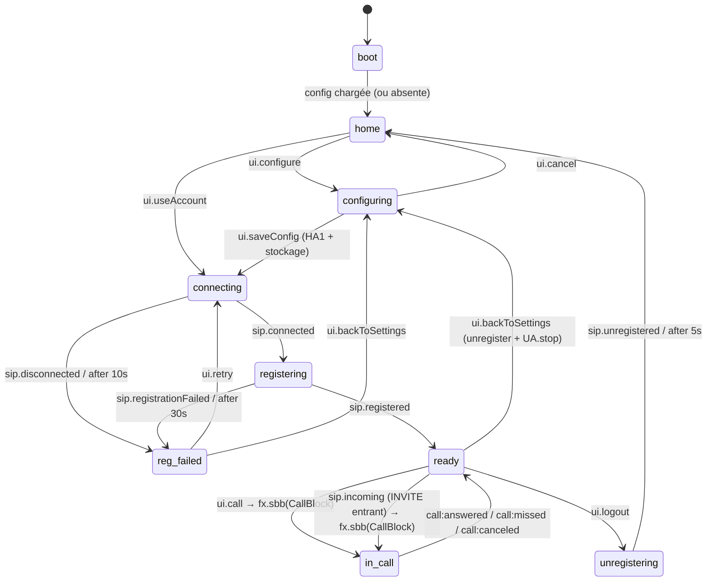
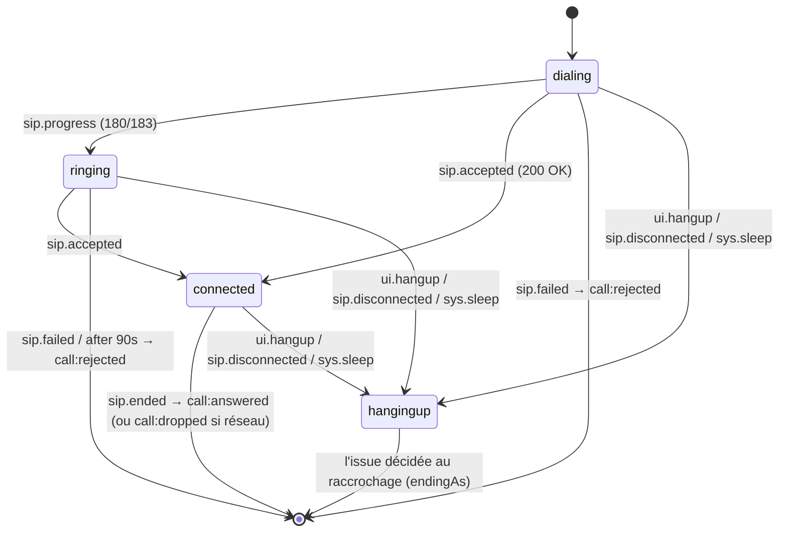
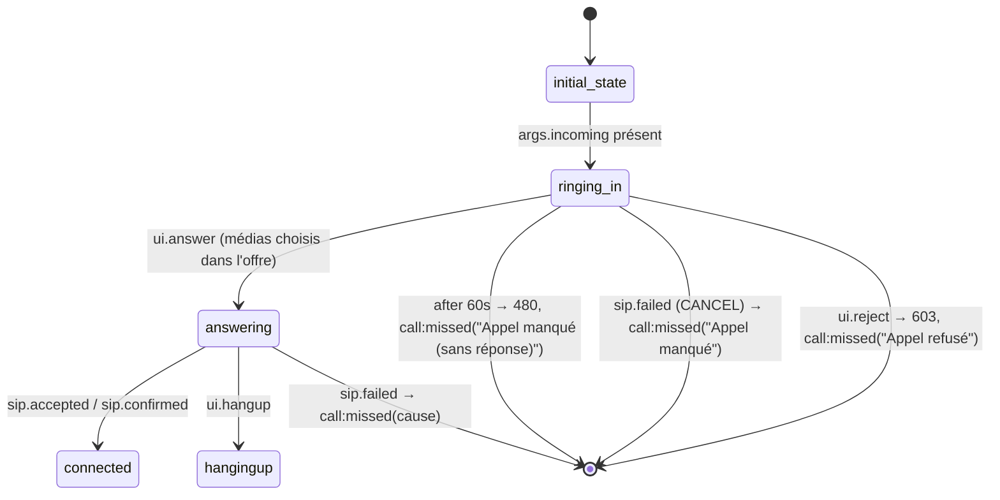

# Conception technique — Trix Communicator

**Statut :** Brouillon — Phase 0
**Dernière mise à jour :** 2026-08-15

## 1. Pile technique

| Couche | Choix | Justification |
|---|---|---|
| Bundler / dev server | **Vite** + TypeScript strict | standard, HMR, build ESM |
| Logique applicative | **finite-state-language** (FSL) v0.2.x | machines à états typées, blocs de service (SBB), diagrammes extraits des sources, zéro dépendance, ESM |
| Signalisation SIP | **JsSIP** | SIP over WSS, support `ha1`/`realm` natif, RTCSession |
| UI | **TypeScript vanilla** (DOM direct, rendu piloté par `instance.subscribe()`) | 3 écrans seulement ; évite React ; bundle minimal ; le hook `finite-state-language/react` reste une porte de sortie si l'UI se complexifie |
| Tests | Vitest + fake timers | même outillage que FSL lui-même |

FSL est ESM only et exige des handlers synchrones (l'async passe par `fx.task`/`fx.delay`) —
contrainte structurante assumée : **aucun `await` dans la logique d'états**.

Point de départ recommandé : `fsl-typescript/typescript/test/webphone.test.ts` — un webphone
SIP factice déjà écrit avec FSL (états `registering / ready / calling_out / ringing_in /
connected / call_failed`), à transposer sur JsSIP.

## 2. Architecture

```
┌───────────────────────────────────────────────┐
│ UI (vanilla TS)                               │
│  screens/home  screens/config  screens/call   │
│        │  render(snapshot)        ▲           │
│        ▼                          │subscribe  │
├───────────────────────────────────────────────┤
│ Machines FSL                                  │
│  PhoneMachine ──fx.sbb──► CallBlock (l'appel) │
├───────────────┬───────────────────────────────┤
│ sip/binding.ts│ storage/SecureStore           │
│ (JsSIP⇄events)│  browserStore (WebCrypto)     │
│               │  [futur: tauriStore (keyring)]│
├───────────────┴───────────────────────────────┤
│ JsSIP (UA, RTCSession)   │ WebRTC (navigateur)│
└───────────────────────────────────────────────┘
```

Principes :
- **La UI ne parle jamais à JsSIP.** Elle envoie des événements `ui:*` à la machine et re-rend
  sur chaque snapshot (`state` + `context`).
- **JsSIP ne décide de rien.** Le binding (~50 lignes) convertit les callbacks JsSIP en
  événements `sip:*` envoyés à la machine ; les objets `UA` et `RTCSession` vivent dans le
  contexte des machines.
- Grâce à la *selective receive* de FSL (queue `pending` rejouée à chaque changement d'état),
  un événement SIP arrivant pendant une transition (ex. INVITE entrant) n'est pas perdu.

### Arborescence cible

```
src/
  main.ts                 # bootstrap, détection config, start(PhoneMachine)
  machines/
    phone.ts              # PhoneMachine (cycle de vie app + REGISTER)
    call.ts               # CallBlock (bloc de service : l'appel)
    events.ts             # types d'événements ui:* / sip:*
  sip/
    binding.ts            # JsSIP → phone.send({type:"sip:..."})
    uri.ts                # normalisation adresse (ajout @domaine, sip:)
    trace.ts              # trace des paquets SIP et des états d'appel (§5.2)
    record.ts             # carnet d'un appel, attaché à son historique (§5.3)
    stats.ts              # statistiques média : fenêtre 10 s + bilan d'appel (§5.4)
  storage/
    store.ts              # interface SecureStore + implé navigateur
    ha1.ts                # MD5(username:realm:password)
  ui/
    screens/{home,config,call}.ts
    langpicker.ts         # sélecteur de langue (accueil + paramètres)
    flags.ts              # drapeaux dessinés, pour ce qu'un emoji ne dit pas
    tracedialog.ts        # relecture du carnet d'un appel, en popup (§5.3)
    screens/call/stats.ts # encart des statistiques média, en direct et après coup (§5.4)
    theme.ts              # tokens FSL clair/sombre
  i18n/
    index.ts              # registre Vite, détection, t()/tn(), formats Intl
    types.ts              # Dictionary, Msg — sans dépendance à l'exécution
    locales/*.ts          # un fichier par langue, le français fait référence
  debug/
    observability.ts      # export toMermaid(), logger de transitions
```

## 3. Conventions d'événements

- `ui:*` — actions utilisateur : `ui:configure`, `ui:saveConfig`, `ui:useAccount`,
  `ui:call {target, video}`, `ui:hangup`, `ui:backToSettings`, `ui:logout`, `ui:retry`,
  `ui:muteMic`, `ui:toggleVideo`, `ui:answer {video}`, `ui:reject`, `ui:acceptVideo`,
  `ui:rejectVideo`, `ui:dtmf {tone}` (ph. 4)
- `sip:*` — remontées JsSIP : `sip:connected`, `sip:disconnected`, `sip:registered`,
  `sip:unregistered`, `sip:registrationFailed {cause}`, `sip:newSession {session}`,
  `sip:progress`, `sip:accepted`, `sip:confirmed`, `sip:ended {cause}`, `sip:failed {cause}`
- `task:*` / `child:*` / `parent:*` — mécanique FSL (`fx.task`, sous-machines).

## 4. Machines à états

### 4.1 PhoneMachine (cycle de vie application + enregistrement)



Décisions :
- `boot` (= `initial_state`) : `fx.task(store.load(), "loadConfig")` → pré-remplit le contexte.
- **« Paramètres » et « Déconnexion » désenregistrent et arrêtent l'UA** — pas d'UA vivant
  hors de `ready`/`in_call` : simple, prédictible, re-REGISTER propre à chaque retour.
- L'UA JsSIP est créé dans `enter` de `connecting` et stocké dans le contexte.
- En `ready`, l'indicateur UI suit l'état de la machine, pas un flag séparé. Une perte de
  transport (`sip:disconnected`, REGISTER resté sans réponse) part en `reconnecting` ; un refus
  du registrar (réponse SIP) part en `reg_failed`.
- Un réveil détecté renvoie un REGISTER sur le transport existant (`handle.refresh()`). Recréer
  l'UA donnerait un nouveau Call-ID et un nouveau contact : le client se désenregistrerait puis
  se réenregistrerait à chaque réveil. On ne repart d'un nouvel UA que si le transport est fermé.
- Timers : `after` de FSL (armé à l'entrée, annulé à la sortie).

### 4.2 CallBlock — appel sortant (phase 2)

L'appel est un **bloc de service** (FSL §8.4), pas une seconde machine :
`in_call` fait `fx.sbb(CallBlock, { args: { target, media, direction, incoming } })`
et se suspend là. Une seule instance, un seul contexte, une seule boîte aux
lettres.

Ce choix a été retourné en 0.2 : la version précédente spawnait une
`CallMachine`, et le prix en était visible — un miroir `CallView` chez le
parent tenu à jour par `notifyParent` après chaque changement, les commandes
UI relayées puis rejouées, et une ligne d'historique reconstituée chez le
parent à partir de `endedBy`, d'un timestamp et d'un code de sortie. Deux
contextes tenus en phase à la main, ce qui est la forme que prend une
sous-routine écrite comme un acteur. La discriminante n'est pas de savoir
qui détient la `RTCSession` mais si les deux machines ont des **vies
séparées** : le téléphone n'a rien d'autre à faire pendant l'appel.

Ce que le bloc y gagne :

- **le contexte est partagé.** Le bloc écrit `ctx.call` — la vue que l'UI
  rend déjà — directement dans le contexte du téléphone. Plus de miroir,
  plus de `child:msg`, plus de relais de commandes : les événements `ui:*`
  lui arrivent parce que c'est la même boîte aux lettres.
- **la sandbox reste privée.** Session JsSIP, sourdines, `endingAs` vivent
  dans `fx.data` : rien qui puisse entrer en collision avec une clé du
  téléphone.
- **l'issue est nommée par qui l'a vue.** Le bloc rend
  `{ type: "call:<outcome>", data }` — `answered`, `dropped`, `rejected`,
  `canceled`, `missed` —, et cet outcome *est* la colonne de l'historique.
  `recordCall` ne redérive plus rien.
- **le bloc consomme tout ce qui arrive pendant l'appel**, y compris ce dont
  la politique appartient au téléphone (perte du proxy, veille,
  enregistrement perdu, second INVITE) : un événement qu'il laisserait
  passer attendrait dans la file un hôte suspendu. Ce qui relève de l'hôte,
  il l'écrit dans le contexte partagé — `lastError`, `sleepRequested` —, et
  `in_call` n'a plus qu'à choisir où revenir.

Vu de l'extérieur, `instance.state` reste `in_call` pendant tout l'appel :
un appel de sous-routine n'est pas un état que la machine a déclaré. Où l'on
est *dans* le bloc se lit dans `instance.sbb` (`{ block, state, depth }`), et
le journal de transitions qualifie : `CallBlock/ringing`.



Le bloc n'a **pas** de borne globale (`timeout: { delay: "infinity" }`) : un
appel finit quand le dialogue finit. Les délais sont portés par les états —
90 s de sonnerie, 60 s d'appel entrant, 30 s d'établissement, 2 s de
raccrochage.

- `enter(dialing)` : `ua.call(uri, { mediaConstraints: { audio: true, video } , pcConfig })`.
- En `connected` : `ui:muteMic` / `ui:toggleSelfView` = `stay()` + mutation du contexte +
  action JsSIP (`session.mute()`) — pas de changement d'état. `ui:toggleVideo`, lui, engage
  une renégociation et donc un état (§4.4).
- Chrono : timestamp de `sip:accepted` en contexte, la UI dérive l'affichage.
- Flux média : `session.connection` (RTCPeerConnection) → attach `remoteVideo`/`localVideo`.

### 4.3 CallBlock — appel entrant (phase 3)

Même bloc : `initial_state` est un aiguillage traversé sans attendre d'événement,
vers `dialing` (sortant) ou `ringing_in` (entrant, `args.incoming` passé au site d'appel).
Une fois l'appel établi, les deux sens partagent le même état `connected` — mutes,
chrono, vu-mètres et raccrochage sont écrits une seule fois.



Un appel entrant non décroché n'est **pas** un échec, et il n'y a plus rien à
redériver pour le dire : le bloc rend `call:missed` avec le motif exact, que
`PhoneMachine` consigne tel quel (« Appel refusé » vs « Appel manqué »). Un
échec après décrochage (média refusé par l'OS, réponse finale d'erreur) sort
par le même outcome — la ligne d'historique est la même — avec la cause en
motif.

Règles de réponse, dérivées de l'offre SDP de l'INVITE (`sip/sdp.ts` : un flux compte
s'il a un port non nul et n'est pas `inactive`) :
- vidéo proposée → boutons « Répondre en vidéo » **et** « Répondre en audio » ;
- audio seul proposé → uniquement « Répondre en audio » ;
- vidéo seule proposée → uniquement « Répondre en vidéo ».

Côté port (`sip/port.ts`), l'INVITE arrive en `sip:incoming` avec un objet `IncomingCall`
— identité, médias proposés, `listen` / `answer(media)` / `reject(reason)`. Les codes SIP
de refus ne vivent que là : `declined` → 603, `busy` → 486, `timeout` → 480.

**Un appel à la fois** : `ready` est le seul état qui accepte un INVITE. En communication
il est refusé occupé (486), partout ailleurs (connexion, reconnexion, veille, échec
d'enregistrement) temporairement indisponible (480).

#### Alerte d'appel entrant (accessibilité — `ui/alert.ts`)

Le public visé étant sourd ou malentendant, la sonnerie est un canal d'appoint : l'alerte
réelle est visuelle. `ui/alert.ts` est le point unique qui démarre et arrête **tous** les
canaux, piloté par le seul état `ringing_in` — aucun canal n'a de cycle de vie propre :

| canal                | couvre le cas où…                                |
|----------------------|--------------------------------------------------|
| flash plein écran    | l'application est à l'écran                       |
| titre d'onglet       | l'application est dans un onglet d'arrière-plan   |
| favicon clignotant   | idem, repérable dans la barre d'onglets           |
| notification système | la fenêtre est masquée ou minimisée               |
| vibration            | téléphone en poche ou posé (Android)              |
| wake lock            | l'écran allait s'éteindre — le flash serait perdu |

Contraintes tenues :
- **photosensibilité** : cadence < 1 Hz, très en deçà des trois flashs par seconde de
  WCAG 2.3.1, et pas de rouge saturé (violet ⇄ vert) ; sous `prefers-reduced-motion`,
  le cadre devient permanent au lieu de clignoter ;
- **lisibilité** : le flash porte sur un cadre périphérique, pas sur un voile plein écran —
  les boutons de réponse restent lisibles et cliquables (`pointer-events: none`) ;
- **permissions** : la notification système n'est demandée que sur clic explicite
  (`Activer les alertes système`), jamais à l'ouverture ;
- **extinction sûre** : `ui/app.ts` coupe l'alerte dès qu'un écran hors appel est rendu —
  l'alerte vit hors de `#app` (flash, titre, notification), elle ne peut donc pas être
  emportée par un simple re-rendu ;
- **réglage utilisateur** : le flash est débrayable par `AccountConfig.flashAlert` (case à
  cocher de l'écran de configuration, active par défaut). Il est stocké **avec le compte**,
  chiffré comme le reste — pas dans les préférences locales (`ui/prefs.ts`, thème et taille
  de texte) : c'est un réglage d'accessibilité de la personne, il doit suivre le compte et
  non le navigateur. Seul le flash est débrayable ; les autres canaux ne perturbent pas
  l'écran et restent le filet de sécurité de l'alerte.

Pour un futur empaquetage Tauri (§8), ces canaux ont des équivalents natifs plus visibles
(notification système native, `requestUserAttention` sur la fenêtre) : `ui/alert.ts` est
l'unique endroit à adapter.

### 4.4 Négociation des médias en cours d'appel

En conversation totale, la vidéo n'est pas une sourdine locale : elle est **dans**
l'appel ou elle n'y est pas, et les deux correspondants voient la même chose. Trois
conséquences, tenues par le port (`sip/port.ts`) et par trois états du bloc.

**Répondre en audio à une offre vidéo, c'est le dire.** Laissé à lui-même, le
navigateur répond `a=recvonly` sur la m-line vidéo — il ne capte pas d'image mais
accepte d'en recevoir : l'appelé qui a choisi « Répondre en audio » verrait quand
même son correspondant. Le port ferme donc le flux des deux côtés : le transceiver
vidéo passe `inactive` dès `have-remote-offer` (les transceivers de l'offre existent,
la réponse n'est pas encore écrite), et `sdp.withoutVideo()` garantit que la réponse
partie sur le fil le dit aussi. La m-line n'est pas rejetée (port 0) mais désactivée :
elle reste disponible pour une escalade ultérieure.

**Ce que l'appel transporte se lit sur la connexion, pas sur l'intention.** Un seul
observateur — le retour de `signalingState` à `stable` — recalcule les médias depuis
`currentDirection` de chaque transceiver et émet `sip:mediaChanged`. Il couvre du même
coup l'établissement et les renégociations, dans les deux sens. Le bloc compare ce
résultat à ce qu'il avait demandé (`data.asked`) : la différence est exactement ce qui
s'affiche — « Bob n'a pas accepté la vidéo ».

**Ajouter ou retirer la vidéo est un re-INVITE.** L'icône de la caméra n'est plus une
sourdine : elle envoie `ui:toggleVideo`, le port ouvre (ou ferme) la caméra puis
renégocie, et le bloc attend l'issue en `renegotiating` — l'appel continue derrière,
seule l'icône patiente. Deux détails de JsSIP méritent d'être écrits :

- `renegotiate()` n'est pas utilisé : son gestionnaire d'échec **raccroche l'appel**
  (500 Media Renegotiation Failed). Un 488 n'est pas une fin d'appel, c'est un non.
  Le port passe donc par `_sendReinvite` avec ses propres gestionnaires, et remet la
  connexion d'aplomb (`setLocalDescription({type:"rollback"})`) — sans quoi elle
  resterait en `have-local-offer` et plus aucune renégociation ne serait possible.
- le re-INVITE **reçu** est intercepté (`_receiveReinvite`) plutôt que traité par
  l'événement public `reinvite`, qui ne se décide que sur-le-champ. Accepter la vidéo
  allume une caméra : cela demande l'accord de son propriétaire, donc du temps. La
  transaction serveur a déjà envoyé son 100 Trying, l'appelant patiente sans rien
  faire expirer, et le bloc pose la question en `video_offer` — 200 OK si l'utilisateur
  accepte, 488 Not Acceptable Here s'il refuse ou ne répond pas en 25 s. Ce qui ne
  fait qu'ôter la vidéo, ou n'y touche pas, suit le chemin normal de JsSIP.

Les deux nouveaux états publient `connected` dans la vue : l'appel n'a pas changé de
nature parce qu'une offre est en vol, et raccrocher, couper son micro ou masquer son
self-view y marchent comme partout ailleurs (`inCall()`, écrit une fois pour les trois).

**Ce qui vient de se passer n'est pas un état.** Un refus de vidéo est un événement,
pas une propriété de l'appel : l'afficher à demeure mentirait dès la seconde suivante.
Le bloc le publie donc comme `CallView.notice`, numéro d'ordre compris — c'est lui, et
non le texte, qui permet à l'écran de distinguer un message neuf d'un rendu de plus —
et `ui/toast.ts` le montre quelques secondes, hors de `#app` comme l'alerte d'appel
entrant, pour survivre au re-rendu qui l'a déclenché.

### 4.5 Observabilité (phase 2)

- `npm run diagrams` régénère [DIAGRAMS.md](DIAGRAMS.md) et un test échoue si le fichier
  a divergé du code — la conception et le code ne peuvent pas diverger silencieusement.
- `DIAGRAMS.md` couvre la machine **et** le bloc : un bloc est extrait comme une
  machine, ses sorties `fx.sbbReturn` sont les arêtes vers `[*]` étiquetées par
  l'événement rendu, et l'état hôte qui l'entre porte `sbb CallBlock` — il n'a pas
  d'arête sortante tant que le bloc n'a pas rendu la main, ce qui est exactement
  ce qui s'y passe.
- Les clauses que tous les états d'un bloc partagent sont écrites une fois
  (`on: { ...interruptions(…), … }`) et l'extracteur résout ce fragment : sans
  cela, le diagramme n'aurait montré aucune arête pour la perte de proxy ni pour
  la veille, qui sont pourtant traitées partout.
- Les diagrammes viennent de `finite-state-language/diagram`, qui analyse les sources
  des machines — pas de `Machine.toMermaid()`. À l'exécution, les handlers sont des
  closures opaques : la bibliothèque ne voit que la forme raccourcie
  `on: { evt: "cible" }`, que ces machines n'utilisent jamais. Le source, lui, écrit
  chaque cible en clair dans `goto("cible")`.
  L'extraction ignore les gardes : elle sur-approxime, jamais l'inverse.
- `start({ debug: true, logger })` : chaque transition loggée au format Elixip
  (`sip:accepted: (calling_out) -> (connected) "200 OK"`), ring buffer `instance.log`
  consultable pour le support.
- `ui/diagnostics.ts` porte à la console ce que les automates savent d'un incident et
  que l'écran résume en une phrase. Les machines n'en savent rien : le module observe
  ce qu'elles publient déjà. Quatre traces, toutes préfixées `[trix]` :
  - **erreurs métier** — une ligne par nouvelle valeur de `lastError` / `callError`,
    avec l'état (bloc compris) et l'événement déclencheur ;
  - **défauts du moteur** — exception dans un état, `goto` inconnu, transition rendue
    après `fx.sbb`. `finite-state-language` les émet par le `logger` avec le préfixe
    `[NomDeMachine]`, que les lignes de transition n'ont pas : `machineLogger` s'en
    sert pour les faire ressortir en `console.error`, journal joint ;
  - **mort de la machine** — une finalisation en `failure` fige l'application sans
    que rien ne l'annonce ; `instance.done` la signale, journal joint ;
  - **événements non consommés** — restés en file d'attente, c'est-à-dire un état sans
    clause pour eux (invariant 7 des SBB, §4.3).
  L'inspection est différée d'une microtask, comme le rendu (§4.6) et pour la même
  raison. `window.trix.dump()` rend le journal des transitions en clair, à joindre à
  un rapport de bug.

### 4.6 Rendu : une microtask après la transition

`main.ts` ne rend pas dans le callback d'abonnement, mais dans une microtask
coalescée. La notification d'une transition part **avant** le `enter()` de l'état
d'arrivée : rendre sur place afficherait ce que l'état *précédent* avait publié —
`CallBlock` écrit `ctx.call` dans son `enter()`, et l'écran serait resté sur
« Sonnerie » pendant toute la communication, faute d'une autre notification à
venir. La microtask s'exécute après la chaîne de transitions synchrones, `enter()`
compris, et n'en rend que le résultat ; les rendus intermédiaires d'une même chaîne
sont fondus en un seul. `ui/diagnostics.ts` inspecte le contexte de la même façon,
pour la même raison.

### 4.7 Internationalisation

Un fichier par langue dans `src/i18n/locales/`, découvert par
`import.meta.glob` : ajouter une langue, c'est déposer `xx.ts`, sans registre
à tenir ni sélecteur à compléter. Trois décisions structurent le reste.

**Le français fait référence.** `Dictionary` est le type du dictionnaire
français ; toute autre langue doit le satisfaire. Une clé ajoutée d'un côté
et oubliée de l'autre fait échouer `npm run build` — c'est le seul filet qui
empêche une langue de partir en lambeaux au fil des évolutions. Ce que le
compilateur ne peut pas voir (valeur vide, variable `{cause}` perdue en
traduction) est couvert par `test/i18n.test.ts`, qui balaie le même glob.

**Le nom du fichier est la balise BCP-47.** `fr`, `fr-CA`, `en`, `ar`, `ja`,
`zh-Hans` : la même chaîne sert au chargement, à `<html lang>`, aux
formateurs `Intl` et à `Intl.DisplayNames`, qui donne le nom de la langue
*dans cette langue* pour le sélecteur. La balise peut donc être aussi précise
que la langue l'exige — `zh-Hans` se nomme « 简体中文 » quand `zh` ne dirait
que « 中文 », `fr-CA` « Français canadien » —, et deux variantes d'une même
langue cohabitent sans se gêner : `detectLocale()` cherche la balise exacte
avant la sous-étiquette primaire, si bien qu'un navigateur réglé sur `fr-CA`
obtient le québécois, sur `fr-CH` le français de référence, et sur `zh-CN` le
chinois simplifié.

Aucun catalogue de métadonnées à maintenir en parallèle, donc aucun à
oublier — le sens d'écriture se déduit de la balise, et le drapeau qui
précède chaque entrée du sélecteur aussi : `localeFlag()` demande à
`Intl.Locale#maximize()` la région la plus probable (« ja » → « JP ») et en
transpose les deux lettres en indicateurs régionaux. Deux exceptions,
déclarées dans `FLAG_OVERRIDE` : l'anglais de Trix porte 🇬🇧 là où CLDR aurait
dit 🇺🇸, son orthographe étant britannique ; et l'arabe 🇹🇳 là où il aurait dit
🇪🇬 — l'arabe standard moderne n'étant la langue propre d'aucun pays, le
drapeau est ici un choix assumé et non une déduction. « Automatique » prend le
globe 🌐, n'étant d'aucun pays. `NAME_OVERRIDE`, à côté, corrige de même le
seul libellé qu'`Intl` nomme mal : `fr-CA` s'affiche « Québécois », ce que le
dictionnaire est réellement — et les moteurs ne s'accordaient même pas sur
l'autre nom (« Français (Canada) » sous Chrome, « français canadien » sous
Node).

**Le fleurdelisé a coûté le `<select>`.** Unicode ne code que trois drapeaux
de subdivision — Angleterre, Écosse, pays de Galles —, le Québec n'en est
pas, et aucun navigateur n'affiche d'image dans un `<option>` : montrer le
drapeau du français canadien imposait de remplacer le contrôle natif par un
menu de boutons (`ui/langpicker.ts`, sur le motif de celui du mode d'appel).
Ce n'est pas gratuit — la roue de sélection d'iOS, la recherche à la lettre
et le clavier gratuit s'en vont avec lui, et il a fallu réécrire flèches,
Origine, Fin, Échap et le retour du focus (en micro-tâche : `renderApp` câble
l'écran avant de le poser dans le document, et un élément détaché ne prend pas
le focus). En échange, `ui/flags.ts` dessine six drapeaux en SVG minuscules
servis en `data:`, qui s'affichent aussi sous Windows — lequel n'embarque aucun
glyphe de drapeau et rendait jusqu'ici « FR », « GB » en toutes lettres.
L'emoji déduit reste le repli de toute langue qu'on n'a pas dessinée, et une
case vide celui de qui n'a ni l'un ni l'autre : déposer `de.ts` continue de
suffire, et la colonne des drapeaux ne se brise sur aucune entrée.

**Les automates ne parlent aucune langue.** `ctx.lastError`, `ctx.callError`
et le motif de chaque ligne d'historique sont des `Msg` — une clé et ses
variables, traduites au rendu seulement. Trois conséquences : les machines
restent testables sur des identifiants stables plutôt que sur des phrases,
l'historique persisté se relit dans la langue courante même pour des appels
passés dans une autre, et changer de langue met à jour l'erreur affichée au
lieu de la laisser figée. Ce qui n'a pas de traduction — causes JsSIP, codes
SIP — passe par `rawMsg()` et ressort tel quel : un code d'erreur traduit
n'est plus cherchable.

Le choix de l'utilisateur (`localStorage`, clé `trix-lang`) admet une valeur
« auto », qui n'est pas l'absence de choix mais celui de suivre le
navigateur — même raisonnement que le thème « système ». Le chargement est
asynchrone (un chunk par langue), `t()` est synchrone : `main.ts` attend
`initI18n()` avant le premier rendu, et `setLocaleChoice()` ne notifie
qu'une fois le dictionnaire en place. Aucun écran ne peut donc se rendre à
moitié traduit.

**Droite à gauche.** L'arabe pose `dir="rtl"` sur `<html>`, et rien d'autre
n'a à le savoir : `Intl.Locale` donne le sens à partir de la balise, et la
feuille de style n'emploie que des propriétés logiques (`inset-inline-start`,
`border-inline-start`, `margin-inline`) — la mise en page se retourne d'elle-même,
panneau latéral compris. Deux exceptions, parce qu'aucune propriété ne les
couvre : le glisser qui élargit le panneau, dont le signe se lit dans
`isRtl()` (`ui/screens/call/panel.ts`), et les icônes qui disent un sens de
lecture plutôt qu'une chose — flèches d'appel entrant/sortant, porte de
sortie, panneau —, retournées par une règle `[dir="rtl"]`. Le combiné, le
micro et l'horloge ne se retournent pas : ce sont des objets, pas des phrases.

**Le pluriel n'est pas celui du français.** `tn()` passe par
`Intl.PluralRules` : l'arabe demande six formes là où le français en compte
deux, et le japonais comme le chinois une seule. Une langue déclare les siennes dans son propre fichier (`.zero`,
`.two`, `.few`, `.many`), le type `Translation` les autorise à elle seule, et
`tn()` retombe sur `.other` pour celles qu'elle omet. Le français n'a donc
pas à inventer un duel qui n'existe pas. Corollaire assumé : une forme de
pluriel peut se passer du `{n}` — « depuis une minute » — là où le reste du
dictionnaire doit reprendre exactement les variables du français.

Ne sont pas traduits, et c'est délibéré : le nom du produit, le crédit
« Powered by FSL », les descriptions de transitions FSL (`goto(..., "REGISTER
OK")`, versionnées dans `DIAGRAMS.md`) et les traces console, qui s'adressent
au développeur.

## 5. Intégration JsSIP

```ts
const socket = new JsSIP.WebSocketInterface(cfg.proxy);      // wss://…
const ua = new JsSIP.UA({
  sockets: [socket],
  uri: `sip:${cfg.username}@${cfg.domain}`,
  display_name: cfg.displayName,
  realm: cfg.domain,          // hypothèse realm = domaine (cf. risque SPECS)
  ha1: cfg.ha1,               // MD5(username:realm:password) — pas de mot de passe
  register: true,
});
```

- Binding : `ua.on("connected"|"disconnected"|"registered"|"unregistered"|
  "registrationFailed"|"newRTCSession", …)` → `phone.send({type:"sip:…", …})` ;
  idem sur chaque `RTCSession` (`progress`, `accepted`, `confirmed`, `ended`, `failed`)
  → `call.send(…)`.
- DTMF (phase 4) : `session.sendDTMF(tone)` (RFC 4733 par défaut).
- Tchat (phase 4) : data channel via `session.connection.createDataChannel("t140")` —
  à concevoir après analyse de `../generique/composants/tchat3`.

### 5.1 Serveurs ICE (STUN / TURN)

Réglage **du compte** (`AccountConfig.ice`), au même titre que le proxy : c'est
l'opérateur SIP qui fournit ces serveurs, et le paramétrage doit suivre l'utilisateur
d'un poste à l'autre. `sip/ice.ts` en est le seul juge — saisie, validation, dérivation
du schéma — et rend un `RTCIceServer[]` ; le port SIP le passe en `pcConfig`, que JsSIP
attend **par session** (`ua.call()` et `session.answer()`), jamais sur l'UA.

```
champ « Serveur STUN » : hôte[:port]           → stun:hôte[:port]
champ « Serveur TURN » : hôte[:port]           → turn:hôte[:port]
       + case « TURN sur TLS »                 → turns:hôte[:port]?transport=tcp
```

- L'utilisateur saisit un **hôte**, pas une URL : un schéma collé depuis une
  documentation (`stun:`, `turns:`) et un `?transport=…` sont retirés à la saisie. La case
  TLS est donc la seule source de vérité du schéma TURN — rien ne peut la contredire.
- Sans port : 3478 (`turn:`) ou 5349 (`turns:`) par défaut, selon RFC 5766/7065 — la pile
  WebRTC s'en charge, on ne complète pas la saisie.
- Les deux champs sont **facultatifs** : vides, aucun serveur n'est déclaré et l'appel
  reste possible en direct (même réseau, IP publique).
- TURN exige des identifiants (« long-term credential » : le relais est toujours
  authentifié). Contrairement au mot de passe SIP, le mot de passe TURN est **conservé en
  clair dans le coffre chiffré** (§6) : le mécanisme réclame le secret lui-même à chaque
  allocation, aucune empreinte ne peut s'y substituer. Il n'est ressaisi que s'il change —
  le formulaire le reprend tant que serveur et identifiant sont inchangés.

### 5.2 Trace des paquets SIP

Case « Tracer les échanges SIP » de l'écran de configuration (section Diagnostic) :
chaque paquet émis et reçu paraît dans la console, entête visible et corps déplié
sur demande.

```
[trix] SIP → REGISTER sip:example.fr SIP/2.0     ▸ (groupe replié : le paquet entier)
[trix] SIP ← SIP/2.0 401 Unauthorized
```

La même case allume la trace des **états de l'appel**, dans le même flux et sous
le même réglage — c'est de la juxtaposition des deux que se lit un échange : un
180 reçu sans passage en `ringing` ne se voit pas dans une trace de paquets
seule.

```
[trix] SIP → INVITE sip:bob@example.fr SIP/2.0
[trix] FSM (ready) → (CallBlock/initial_state) "sbb CallBlock"
[trix] FSM (CallBlock/initial_state) → (CallBlock/dialing) "INVITE sortant"
[trix] SIP ← SIP/2.0 180 Ringing
[trix] FSM sip:progress: (CallBlock/dialing) → (CallBlock/ringing) "180/183"
[trix] SIP ← SIP/2.0 200 OK
[trix] FSM sip:accepted: (CallBlock/ringing) → (CallBlock/connected) "200 OK"
```

- La trace est prise **au niveau du socket** (`sip/trace.ts` enveloppe `send()` et
  intercepte la pose de `ondata` par le Transport), et non par
  `JsSIP.debug.enable("JsSIP:Transport")`. Deux raisons : le format et le réglage nous
  appartiennent — `debug` écrit dans un `localStorage.debug` global qui n'est pas celui
  de Trix — et surtout `JsSIP.UA` accepte **n'importe quel** objet conforme à
  l'interface `Socket`. Le jour où le texte passera par un WebSocket propriétaire, le
  point de passage sera le même et la trace suivra sans être réécrite.
- Le socket est enveloppé sans condition ; c'est la trace qui consulte le réglage à
  **chaque** paquet. Cocher la case en pleine communication trace donc la suite de
  l'échange, sans redémarrer l'UA ni rouvrir le transport.
- Réglage local (`localStorage`, clé `trix-siptrace`), jamais enregistré avec le compte :
  il décrit une séance de dépannage, pas un utilisateur.
- Les keep-alive (CRLF) tiennent sur une ligne, sans groupe à déplier ; les paquets
  binaires sont décodés en UTF-8 — certains proxys n'envoient que cela.
- La trace de la FSM (`traceCallStates`, branchée dans `main.ts`) s'abonne à la machine
  et ne rapporte que le **bloc** en cours — son entrée, ses transitions internes, son
  retour à l'hôte : l'appel, aujourd'hui le seul bloc (§4.3). Les transitions du
  téléphone lui-même n'y sont pas ; elles ne racontent pas un échange SIP, et le
  `logger` de la machine les porte déjà en `console.debug` (§4.5). Le format est celui
  du journal (`window.trix.dump()`), pour que les deux se relisent ensemble.
- Comme pour les paquets, le réglage est consulté à **chaque** transition : cocher la
  case pendant la sonnerie trace la suite de l'appel.
- `JsSIP.debug.enable("JsSIP:*")` reste disponible depuis la console pour fouiller les
  entrailles de JsSIP quand le besoin dépasse les paquets.
- Ce qui passe par là est aussi gardé, appel par appel, pour être relu depuis
  l'historique : voir §5.3.

### 5.3 Le carnet d'un appel

La console dit l'échange pendant qu'il a lieu ; encore faut-il l'avoir ouverte au
bon moment. Le carnet répond à l'autre besoin, celui du support : *« l'appel de
14 h 32 a été coupé, que s'est-il passé ? »*. Chaque appel terminé emporte donc
dans sa ligne d'historique les paquets de **son** dialogue et les états traversés,
relus depuis un parchemin posé sur la ligne.

```
14:32:07.118 → INVITE sip:bob@example.fr SIP/2.0     ▸ (le paquet entier, dépliable)
14:32:07.121    (CallBlock/initial_state) → (CallBlock/dialing) "INVITE sortant"
14:32:07.340 ← SIP/2.0 180 Ringing
```

- Le découpage se fait sur le **Call-ID**, jamais sur le temps : c'est ce qui
  sépare les paquets de l'appel de ceux du REGISTER périodique, et d'un second
  INVITE refusé « occupé » pendant la communication. Les REGISTER sont écartés
  d'emblée — requête reconnue à sa ligne de départ, réponse à la méthode de son
  CSeq —, ils portent l'empreinte du compte et n'apprennent rien d'un appel.
- Un carnet peut s'ouvrir **après** le premier paquet de son dialogue : l'INVITE
  entrant est justement ce qui déclenche l'appel. `sip/record.ts` garde donc de
  quoi rattraper les derniers dialogues vus, et le carnet les récupère à son
  ouverture.
- Le carnet d'un entrant n'est ouvert que dans `IncomingCall.listen()`, pas à
  l'arrivée de l'INVITE : un second appel refusé « occupé » n'est jamais écouté,
  et n'a donc pas de carnet à voler à la communication en cours.
- Rien n'est collecté quand la case est décochée — la décision se prend une fois,
  en tête de chaque trace (`sip/trace.ts`), et la cocher en pleine communication
  fait démarrer le carnet en cours de route.
- Le chemin est celui des autres données de l'appel : `CallSession.trace()` rend
  les lignes, le bloc les a publiées avec sa dernière vue, `recordCall` les
  attache à l'entrée (§4.2). Rien de neuf ne traverse les machines.
- Plafonds par appel — 200 lignes, 64 Ko, 4 Ko par corps — au-delà desquels la
  trace s'arrête sur une marque visible. Un dialogue pathologique (ré-INVITE en
  boucle, SDP géant) ne doit pas faire gonfler le coffre, où les carnets vivent
  chiffrés aux côtés des 50 dernières lignes d'historique (§6). Ils s'effacent
  avec elles.
- L'affichage (`ui/tracedialog.ts`) est un `<dialog>` natif : Échap, piège à
  focus, inertie du fond et retour du focus sont acquis, là qu'une surimpression
  maison réimplémenterait de travers. Le corps d'un paquet se déplie d'un
  `<details>`, comme un groupe de la console, et le contenu reste en LTR même en
  interface arabe — c'est du protocole, pas de la prose.

### 5.4 Statistiques média en cours d'appel

Un appel qui hache ne se diagnostique pas avec des paquets SIP : la signalisation
est passée depuis longtemps, c'est le média qui souffre. La pastille
« En communication » découvre donc un encart — au survol, au focus clavier ou au
clic, qui le fixe — portant ce que la pile WebRTC sait du flux réel.

```
Statistiques média  moyenne sur 10 s
                Reçu          Émis
AUDIO
Codec           opus 48 kHz   opus 48 kHz
Débit           32,4 kbit/s   31,8 kbit/s
Perte           0,4 %         6 %
VIDÉO
Codec           VP8           VP8
Débit           560 kbit/s    480 kbit/s
Perte           1,1 %         0,3 %
Aller-retour 42 ms
Perte à l'émission d'après les rapports de réception du correspondant.
```

- **Fenêtre glissante de 10 s**, jamais la moyenne de l'appel. `getStats()` ne rend
  que des compteurs cumulés depuis le décrochage : lus tels quels, ils affichent
  0,1 % de perte sur une conversation inaudible depuis dix secondes. `sip/stats.ts`
  échantillonne à 1 Hz, ne garde que les échantillons de la fenêtre et n'expose que
  la différence entre ses deux bornes. Les deux derniers échantillons survivent
  toujours à la purge : un onglet en arrière-plan espace les mesures, et il vaut
  mieux une fenêtre trop large que plus de chiffre du tout.
- **Deux compteurs de perte, deux calculs.** En réception, `inbound-rtp` compte les
  paquets reçus et les manquants de la numérotation : le total attendu est leur
  somme. En émission, rien ici ne peut savoir ce qui s'est perdu en route — le
  chiffre vient du distant, par les rapports de réception RTCP (RR) agrégés dans
  `remote-inbound-rtp`, rapportés aux paquets envoyés, qui comptent déjà les perdus.
  L'encart le dit en toutes lettres : ce n'est pas une mesure locale.
- Les flux multiples d'un même média (simulcast, plusieurs SSRC) s'additionnent :
  ce qu'on lit est le débit de la vidéo, pas celui de chacune de ses couches.
- **Sous la même case que la trace SIP** (§5.2) : c'est le même outillage de
  diagnostic. Décochée, la pastille reste une pastille, et aucun `getStats()` n'est
  demandé sur la connexion pair-à-pair d'un appel ordinaire. Le réglage est consulté
  à **chaque** relevé, comme pour les paquets : cocher la case en pleine
  communication fait démarrer la mesure.
- **L'échantillonnage est dans le port** (`sip/port.ts`, une fois par seconde et
  pour toute la durée de la session), et non dans l'UI. Une seule série de relevés
  alimente les deux lectures — la fenêtre de 10 s pendant l'appel, le bilan gardé
  après —, et la connexion pair-à-pair n'est de toute façon plus interrogeable une
  fois la session terminée. L'UI ne fait que lire (`CallSession.mediaStats()`) et
  dessiner ; elle n'a pas d'état de mesure à protéger des re-rendus, qui arrivent à
  chaque notification de la machine (couper le micro suffit). Les rapports bruts ne
  sont pas conservés : chacun est réduit à quelques compteurs à la prise.
- Rien ne traverse les machines pendant l'appel — un débit n'est pas un état du
  protocole, et le faire passer par le contexte redéclencherait un rendu complet de
  l'écran à chaque seconde.
- Découverte, et non info-bulle : survol, focus et clic l'ouvrent, Échap et un clic
  ailleurs la ferment. Une donnée qui ne s'obtiendrait qu'à la souris n'existerait
  pas pour une partie des utilisateurs (RGAA 13.10), et il n'y a pas de survol au
  doigt. Encart fermé, la boucle de rafraîchissement s'arrête : il n'y a rien à
  redessiner, et la mesure, elle, continue dans le port.

#### Le bilan de l'appel, dans l'historique

L'appel raccroché, son bilan média rejoint sa ligne d'historique, à côté du carnet
de trace : une **loupe** posée sur la ligne rouvre le même tableau, mesuré cette
fois sur l'appel entier.

- Le chemin est exactement celui du carnet (§5.3) : `CallSession.callStats()` rend
  le bilan, `recordCall` l'attache à l'entrée (`stats`), le coffre le chiffre avec
  le reste de l'historique. C'est quelques dizaines d'octets par appel, sans
  commune mesure avec les paquets SIP qui l'accompagnent.
- Le bilan compare le **premier** relevé au **dernier**, et non zéro au dernier : la
  case peut se cocher en cours d'appel, et `spanMs` dit alors exactement ce qui a
  été observé — l'encart affiche « moyenne sur 2 min 13 s mesurées », jamais une
  durée d'appel qu'il n'aurait pas mesurée. Le dernier relevé date d'au plus une
  seconde avant le raccrochage : la connexion pair-à-pair ne survit pas à la fin de
  session, il n'y a pas de mesure finale à prendre après coup.
- Rien de mesuré, pas de loupe : c'est la même règle que le parchemin, et elle se
  lit à l'absence du champ dans la ligne.
- Le tableau est le même code (`statsCardHtml`), avec la portée pour seule
  différence, et un bouton **Copier** qui rend les mêmes chiffres en texte tabulé —
  ce qui se colle dans un ticket sans être ressaisi. Les valeurs affichées et
  copiées passent par les mêmes fonctions : un rapport de support ne doit pas porter
  deux arrondis d'une même mesure.
- L'affichage est un `<dialog>` natif, comme le carnet : un appel terminé ne bouge
  plus, il n'a pas à suivre la souris.

## 6. Stockage sécurisé du compte

**Réponse à la question de goals.md (« JS offre-t-il une possibilité de stockage sûr ? ») :**
le navigateur n'offre **pas** de coffre-fort accessible à l'application (pas d'API « wallet »
standard ; la Credential Management API ne stocke que des mots de passe de site, inutilisable
pour des identifiants SIP). La meilleure approximation :

1. **Ne jamais stocker le mot de passe** : à la sauvegarde du formulaire, calcul de
   `ha1 = MD5(username:realm:password)` (MD5 absent de WebCrypto → mini-implémentation locale
   ~150 lignes ou `js-md5`). Le HA1 suffit à JsSIP pour s'authentifier ; sa compromission
   ne révèle pas le mot de passe (mais permet l'usage du compte SIP — d'où le point 2).
2. **Chiffrement au repos** : clé AES-GCM 256 générée par WebCrypto avec
   `extractable: false`, stockée dans IndexedDB (le navigateur la garde dans son profil,
   elle n'est pas exportable par du JS) ; la configuration chiffrée (IV aléatoire par
   écriture) est stockée à côté. Un vol du disque/profil brut ne suffit pas à lire le HA1.
3. **Limite assumée** : tout JS exécuté sur l'origine peut déchiffrer (XSS). Mitigation :
   CSP stricte (`default-src 'self'`), zéro dépendance runtime côté logique (FSL), audit
   des deps.

```ts
interface AccountConfig {
  proxy: string;        // wss://…
  domain: string;
  displayName: string;
  username: string;
  authUsername: string | null; // identifiant d'authentification, si distinct
  ha1: string;          // jamais le mot de passe
  flashAlert: boolean;  // réglage d'accessibilité (§4.3) — suit le compte, pas le navigateur
  ice: IceConfig;       // serveurs STUN/TURN (§5.1), mot de passe TURN compris
}
interface SecureStore {
  load(): Promise<AccountConfig | null>;
  save(cfg: AccountConfig): Promise<void>;
  clear(): Promise<void>;
}
```

`SecureStore` est le **point d'abstraction pour Tauri** : une future implémentation
`tauriStore` (trousseau OS via `tauri-plugin-keyring`/stronghold — libsecret/GNOME Keyring
sous Ubuntu) se substituera à `browserStore` par détection de `window.__TAURI__`,
sans toucher au reste du code.

## 7. Normalisation d'adresse

```
saisie sans "@"  →  sip:<saisie>@<domaine configuré>
saisie avec "@"  →  sip:<saisie>
préfixe sip: déjà présent → inchangé
```

Validation minimale (caractères autorisés) avant `ua.call()` ; l'erreur JsSIP reste le
filet de sécurité (`sip:failed {cause}` affichée).

## 8. Compatibilité Tauri (perspective future — contraintes à respecter dès maintenant)

Décision projet (2026-08-15) : **l'intégration Tauri est reportée**. Les phases 1–4 livrent
une app web pure. On garde néanmoins la compatibilité en ligne de mire :

### Contrainte majeure : WebRTC dans la webview Linux

Tauri utilise la webview système : WebView2/Chromium (Windows, WebRTC OK),
WKWebView (macOS, WebRTC OK), **WebKitGTK (Linux, WebRTC non fonctionnel dans les
paquets standard des distributions)**. État constaté :

- Faire fonctionner `getUserMedia`/`RTCPeerConnection` exige une **compilation custom de
  WebKitGTK** (`-DENABLE_WEB_RTC=ON -DENABLE_MEDIA_STREAM=ON`), les plugins GStreamer
  `bad` (webrtcbin), l'activation de `WebKitSettings` côté Rust
  (`set_enable_webrtc`, `set_enable_media_stream`, …) et un handler
  `connect_permission_request` ; ne fonctionne qu'en X11 (échecs GBM sous Wayland).
  Réf. : tauri-apps/tauri discussion #8426.
- Échec confirmé sur Ubuntu 24.04 / webkit2gtk 2.48 stock (tauri-apps/tauri issue #13143).

Options pour la future phase 5 (à trancher le moment venu) :
1. Tauri pour Windows/macOS uniquement ; Ubuntu servi en web/PWA.
2. Paquet .deb « coque légère » lançant le navigateur système en mode app
   (`chromium --app=…`) au lieu de Tauri.
3. Tauri + WebKitGTK custom embarqué dans le .deb (lourd, maintenance sécurité à charge).

### Règles de compatibilité à respecter dès la phase 1

- **Aucune API Node** côté front (Vite pur navigateur) — déjà garanti par la pile choisie.
- ESM only — OK (FSL et Vite l'imposent).
- Toute la persistance passe par `SecureStore` (§6) — seul point à réimplémenter sous Tauri.
- WSS uniquement (jamais ws://) : requis par les navigateurs et par la CSP Tauri.
- Pas de dépendance à `window.location`/origine pour la logique (l'origine Tauri est
  `tauri://localhost`).
- CSP stricte dès maintenant : la même sera déclarée dans `tauri.conf.json` plus tard.

## 9. Stratégie de tests

- **Machines** : Vitest, pile SIP factice injectée dans le contexte (mêmes patterns que
  `webphone.test.ts` de FSL : fake timers, test de l'INVITE en course avec un changement
  d'état via la pending queue).
- **HA1 & store** : vecteurs de test RFC 2617 pour MD5/HA1 ; round-trip chiffrement WebCrypto.
- **E2E manuel** : contre Kamailio/Elixip local (comptes de test), matrice : register,
  register échoué (mauvais HA1), appel audio, appel vidéo, occupé, no answer, BYE distant.

## 10. Références

- FSL : `~/fsl-typescript/typescript/src/core/types.ts` (API), `spec/fsl-js-ts.md`
  (sémantique), `typescript/test/webphone.test.ts` (webphone de référence)
- JsSIP : https://jssip.net/documentation/
- WebRTC/WebKitGTK : https://github.com/tauri-apps/tauri/discussions/8426 ,
  https://github.com/tauri-apps/tauri/issues/13143
