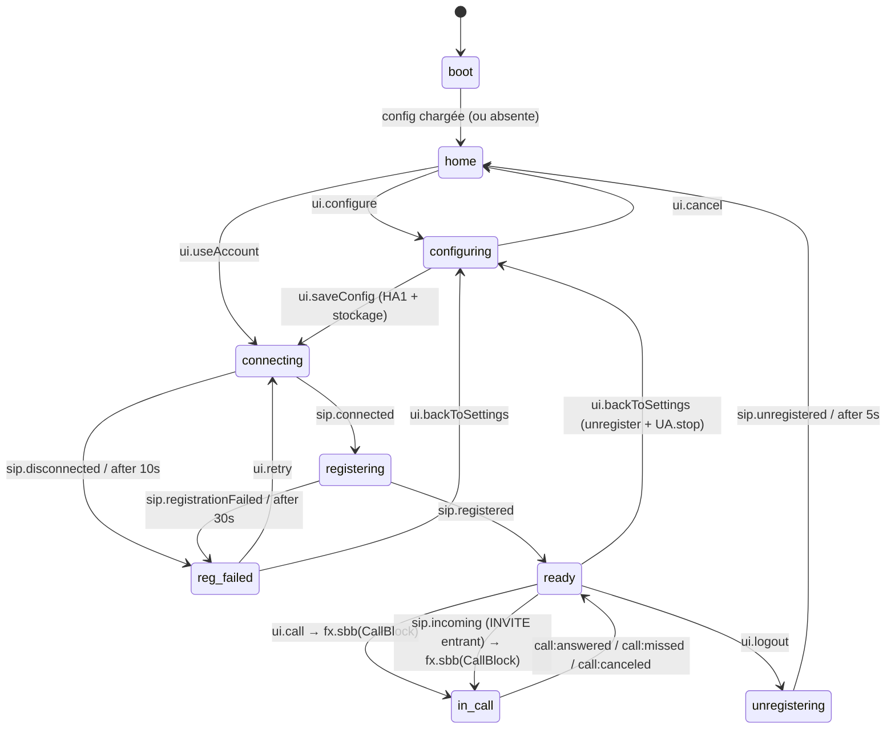
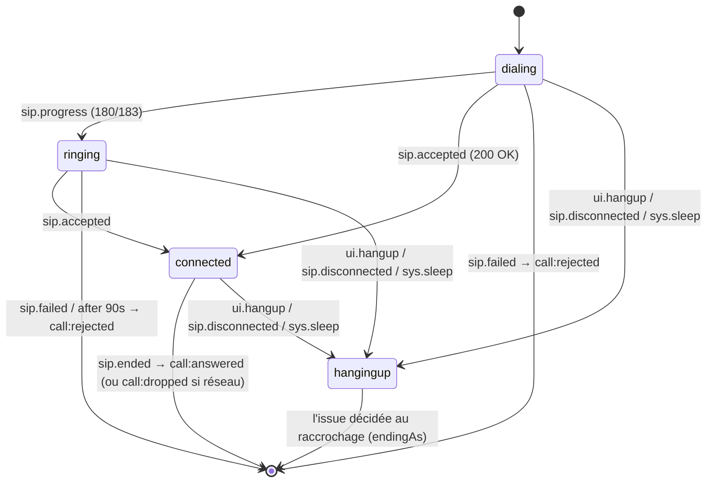
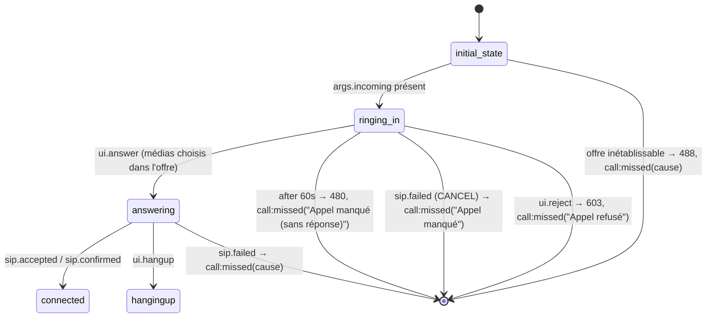

# Conception technique — Trix Communicator

**Statut :** Brouillon — Phase 0
**Dernière mise à jour :** 2026-08-15

## 1. Pile technique

| Couche | Choix | Justification |
|---|---|---|
| Bundler / dev server | **Vite** + TypeScript strict | standard, HMR, build ESM |
| Logique applicative | **finite-state-language** (FSL) v0.2.x | machines à états typées, blocs de service (SBB), diagrammes extraits des sources, zéro dépendance, ESM |
| Signalisation SIP | **JsSIP** | SIP over WSS, support `ha1`/`realm` natif, RTCSession |
| UI | **TypeScript vanilla** (DOM direct, rendu piloté par `instance.subscribe()`) | 3 écrans seulement ; évite React ; bundle minimal ; le hook `finite-state-language/react` reste une porte de sortie si l'UI se complexifie |
| Tests | Vitest + fake timers | même outillage que FSL lui-même |

FSL est ESM only et exige des handlers synchrones (l'async passe par `fx.task`/`fx.delay`) —
contrainte structurante assumée : **aucun `await` dans la logique d'états**.

Point de départ recommandé : `fsl-typescript/typescript/test/webphone.test.ts` — un webphone
SIP factice déjà écrit avec FSL (états `registering / ready / calling_out / ringing_in /
connected / call_failed`), à transposer sur JsSIP.

## 2. Architecture

```
┌───────────────────────────────────────────────┐
│ UI (vanilla TS)                               │
│  screens/home  screens/config  screens/call   │
│        │  render(snapshot)        ▲           │
│        ▼                          │subscribe  │
├───────────────────────────────────────────────┤
│ Machines FSL                                  │
│  PhoneMachine ──fx.sbb──► CallBlock (l'appel) │
├───────────────┬───────────────────────────────┤
│ sip/binding.ts│ storage/SecureStore           │
│ (JsSIP⇄events)│  browserStore (WebCrypto)     │
│               │  [futur: tauriStore (keyring)]│
├───────────────┴───────────────────────────────┤
│ JsSIP (UA, RTCSession)   │ WebRTC (navigateur)│
└───────────────────────────────────────────────┘
```

Principes :
- **La UI ne parle jamais à JsSIP.** Elle envoie des événements `ui:*` à la machine et re-rend
  sur chaque snapshot (`state` + `context`).
- **JsSIP ne décide de rien.** Le binding (~50 lignes) convertit les callbacks JsSIP en
  événements `sip:*` envoyés à la machine ; les objets `UA` et `RTCSession` vivent dans le
  contexte des machines.
- Grâce à la *selective receive* de FSL (queue `pending` rejouée à chaque changement d'état),
  un événement SIP arrivant pendant une transition (ex. INVITE entrant) n'est pas perdu.

### Arborescence cible

```
src/
  main.ts                 # bootstrap, détection config, start(PhoneMachine)
  deployment.ts           # config.json : ce que l'exploitant impose (§2.1)
  machines/
    phone.ts              # PhoneMachine (cycle de vie app + REGISTER)
    call.ts               # CallBlock (bloc de service : l'appel)
    events.ts             # types d'événements ui:* / sip:*
  sip/
    binding.ts            # JsSIP → phone.send({type:"sip:..."})
    uri.ts                # normalisation adresse (ajout @domaine, sip:)
    trace.ts              # trace des paquets SIP et des états d'appel (§5.2)
    record.ts             # carnet d'un appel, attaché à son historique (§5.3)
    stats.ts              # statistiques média : fenêtre 10 s + bilan d'appel (§5.4)
    mediaerror.ts         # échecs WebRTC : console, carnet, motif d'appel (§5.5)
  storage/
    store.ts              # interface SecureStore + implé navigateur
    ha1.ts                # MD5(username:realm:password)
  ui/
    screens/{home,config,call}.ts
    langpicker.ts         # sélecteur de langue (accueil + paramètres)
    flags.ts              # drapeaux dessinés, pour ce qu'un emoji ne dit pas
    tracedialog.ts        # relecture du carnet d'un appel, en popup (§5.3)
    screens/call/stats.ts # encart des statistiques média, en direct et après coup (§5.4)
    theme.ts              # tokens FSL clair/sombre
  i18n/
    index.ts              # registre Vite, détection, t()/tn(), formats Intl
    types.ts              # Dictionary, Msg — sans dépendance à l'exécution
    locales/*.ts          # un fichier par langue, le français fait référence
  debug/
    observability.ts      # export toMermaid(), logger de transitions
```

### 2.1 Configuration de déploiement — `config.json`

Un fichier **lu en HTTP au démarrage, jamais embarqué** : `src/deployment.ts` le
récupère à côté d'`index.html`, avant le premier rendu (`main.ts`, en parallèle du
dictionnaire de langue). Il appartient à l'exploitant, pas au build — une mise à
jour du client ne le remplace pas. Le mode d'emploi, côté serveur, est dans
[docs/utilisation/deploiement.md](utilisation/deploiement.md).

Il fixe ce que la plateforme décide déjà : proxy SIP, domaine SIP, serveurs
STUN/TURN, transport du texte temps réel, existence même de la trace SIP. Chaque
réglage imposé **disparaît de l'écran des paramètres** au lieu de s'y afficher
grisé : un champ qu'on ne peut pas changer n'a pas à être lu, et le formulaire se
remplit d'autant plus vite.

Trois règles tiennent le module :

1. **Absent, illisible ou mal formé n'est pas une erreur.** On retombe sur le
   déploiement *ouvert* — Trix exactement comme sans le fichier. Un exploitant qui
   se trompe de clé retrouve le formulaire entier, jamais un client à moitié
   configuré.
2. **Chaque clé est indépendante.** Imposer le domaine ne dit rien du proxy. Ce que
   le fichier ne dit pas, l'utilisateur le choisit encore.
3. **L'imposé l'emporte sur l'enregistré.** Un compte relu du coffre passe par
   `pinAccount()` avant d'être adopté : le champ masqué ne peut donc pas contredire
   en silence le compte réellement utilisé.

Une seule chose que l'alignement ne rattrape pas : un compte enregistré sur un
**autre domaine** que le domaine imposé. Son HA1 a été calculé avec ce domaine-là
comme *realm* (§6) ; réécrire le domaine laisserait une empreinte qui n'authentifie
rien. Ce compte est donc écarté, et l'utilisateur reconfigure le sien — ce qu'il
devrait faire de toute façon pour obtenir un HA1 utilisable.

La validation ne relève pas de l'écran. `saveConfig` (PhoneMachine) ne lit pas les
champs imposés et refuse une adresse hors du domaine imposé : un formulaire trafiqué
depuis la console ne place pas le compte ailleurs que sur ce déploiement.

`debug_activated: "no"` mérite une mention à part : la clé ne masque pas seulement la
case, elle éteint `sipTraceEnabled()` (§5.2) quoi qu'en dise `localStorage`. Comme
tout ce qui passe par là est aussi proposé au carnet de l'appel (§5.3), c'est du même
coup la fin des paquets SIP dans l'historique — y compris pour qui avait laissé la
trace allumée avant que le fichier n'arrive.

## 3. Conventions d'événements

- `ui:*` — actions utilisateur : `ui:configure`, `ui:saveConfig`, `ui:useAccount`,
  `ui:call {target, video}`, `ui:hangup`, `ui:backToSettings`, `ui:logout`, `ui:retry`,
  `ui:muteMic`, `ui:toggleVideo`, `ui:answer {video}`, `ui:reject`, `ui:acceptVideo`,
  `ui:rejectVideo`, `ui:dtmf {tone}`
- `sip:*` — remontées JsSIP : `sip:connected`, `sip:disconnected`, `sip:registered`,
  `sip:unregistered`, `sip:registrationFailed {cause}`, `sip:newSession {session}`,
  `sip:progress`, `sip:accepted`, `sip:confirmed`, `sip:ended {cause}`, `sip:failed {cause}`
- `task:*` / `child:*` / `parent:*` — mécanique FSL (`fx.task`, sous-machines).

## 4. Machines à états

### 4.1 PhoneMachine (cycle de vie application + enregistrement)


```mermaid
stateDiagram-v2
  [*] --> boot
  boot --> home : config chargée (ou absente)
  home --> configuring : ui.configure
  home --> connecting : ui.useAccount
  configuring --> connecting : ui.saveConfig (HA1 + stockage)
  configuring --> home : ui.cancel
  connecting --> registering : sip.connected
  connecting --> reg_failed : sip.disconnected / after 10s
  registering --> ready : sip.registered
  registering --> reg_failed : sip.registrationFailed / after 30s
  ready --> in_call : ui.call → fx.sbb(CallBlock)
  ready --> in_call : sip.incoming (INVITE entrant) → fx.sbb(CallBlock)
  ready --> configuring : ui.backToSettings (unregister + UA.stop)
  ready --> unregistering : ui.logout
  in_call --> ready : call:answered / call:missed / call:canceled
  reg_failed --> connecting : ui.retry
  reg_failed --> configuring : ui.backToSettings
  unregistering --> home : sip.unregistered / after 5s
```

Décisions :
- `boot` (= `initial_state`) : `fx.task(store.load(), "loadConfig")` → pré-remplit le contexte.
- **« Paramètres » et « Déconnexion » désenregistrent et arrêtent l'UA** — pas d'UA vivant
  hors de `ready`/`in_call` : simple, prédictible, re-REGISTER propre à chaque retour.
- L'UA JsSIP est créé dans `enter` de `connecting` et stocké dans le contexte.
- En `ready`, l'indicateur UI suit l'état de la machine, pas un flag séparé. Une perte de
  transport (`sip:disconnected`, REGISTER resté sans réponse) part en `reconnecting` ; un refus
  du registrar (réponse SIP) part en `reg_failed`.
- Un réveil détecté renvoie un REGISTER sur le transport existant (`handle.refresh()`). Recréer
  l'UA donnerait un nouveau Call-ID et un nouveau contact : le client se désenregistrerait puis
  se réenregistrerait à chaque réveil. On ne repart d'un nouvel UA que si le transport est fermé.
- Timers : `after` de FSL (armé à l'entrée, annulé à la sortie).

### 4.2 CallBlock — appel sortant (phase 2)

L'appel est un **bloc de service** (FSL §8.4), pas une seconde machine :
`in_call` fait `fx.sbb(CallBlock, { args: { target, media, direction, incoming } })`
et se suspend là. Une seule instance, un seul contexte, une seule boîte aux
lettres.

Ce choix a été retourné en 0.2 : la version précédente spawnait une
`CallMachine`, et le prix en était visible — un miroir `CallView` chez le
parent tenu à jour par `notifyParent` après chaque changement, les commandes
UI relayées puis rejouées, et une ligne d'historique reconstituée chez le
parent à partir de `endedBy`, d'un timestamp et d'un code de sortie. Deux
contextes tenus en phase à la main, ce qui est la forme que prend une
sous-routine écrite comme un acteur. La discriminante n'est pas de savoir
qui détient la `RTCSession` mais si les deux machines ont des **vies
séparées** : le téléphone n'a rien d'autre à faire pendant l'appel.

Ce que le bloc y gagne :

- **le contexte est partagé.** Le bloc écrit `ctx.call` — la vue que l'UI
  rend déjà — directement dans le contexte du téléphone. Plus de miroir,
  plus de `child:msg`, plus de relais de commandes : les événements `ui:*`
  lui arrivent parce que c'est la même boîte aux lettres.
- **la sandbox reste privée.** Session JsSIP, sourdines, `endingAs` vivent
  dans `fx.data` : rien qui puisse entrer en collision avec une clé du
  téléphone.
- **l'issue est nommée par qui l'a vue.** Le bloc rend
  `{ type: "call:<outcome>", data }` — `answered`, `dropped`, `rejected`,
  `canceled`, `missed` —, et cet outcome *est* la colonne de l'historique.
  `recordCall` ne redérive plus rien.
- **le bloc consomme tout ce qui arrive pendant l'appel**, y compris ce dont
  la politique appartient au téléphone (perte du proxy, veille,
  enregistrement perdu, second INVITE) : un événement qu'il laisserait
  passer attendrait dans la file un hôte suspendu. Ce qui relève de l'hôte,
  il l'écrit dans le contexte partagé — `lastError`, `sleepRequested` —, et
  `in_call` n'a plus qu'à choisir où revenir.

Vu de l'extérieur, `instance.state` reste `in_call` pendant tout l'appel :
un appel de sous-routine n'est pas un état que la machine a déclaré. Où l'on
est *dans* le bloc se lit dans `instance.sbb` (`{ block, state, depth }`), et
le journal de transitions qualifie : `CallBlock/ringing`.


```mermaid
stateDiagram-v2
  [*] --> dialing
  dialing --> ringing : sip.progress (180/183)
  dialing --> connected : sip.accepted (200 OK)
  dialing --> [*] : sip.failed → call:rejected
  dialing --> hangingup : ui.hangup / sip.disconnected / sys.sleep
  ringing --> connected : sip.accepted
  ringing --> [*] : sip.failed / after 90s → call:rejected
  ringing --> hangingup : ui.hangup / sip.disconnected / sys.sleep
  connected --> [*] : sip.ended → call:answered (ou call:dropped si réseau)
  connected --> hangingup : ui.hangup / sip.disconnected / sys.sleep
  hangingup --> [*] : l'issue décidée au raccrochage (endingAs)
```

Le bloc n'a **pas** de borne globale (`timeout: { delay: "infinity" }`) : un
appel finit quand le dialogue finit. Les délais sont portés par les états —
90 s de sonnerie, 60 s d'appel entrant, 30 s d'établissement, 2 s de
raccrochage.

- `enter(dialing)` : `ua.call(uri, { mediaConstraints: { audio: true, video } , pcConfig })`.
- En `connected` : `ui:muteMic` / `ui:toggleSelfView` = `stay()` + mutation du contexte +
  action JsSIP (`session.mute()`) — pas de changement d'état. `ui:toggleVideo`, lui, engage
  une renégociation et donc un état (§4.4).
- Chrono : timestamp de `sip:accepted` en contexte, la UI dérive l'affichage.
- Flux média : `session.connection` (RTCPeerConnection) → attach `remoteVideo`/`localVideo`.

### 4.3 CallBlock — appel entrant (phase 3)

Même bloc : `initial_state` est un aiguillage traversé sans attendre d'événement,
vers `dialing` (sortant) ou `ringing_in` (entrant, `args.incoming` passé au site d'appel).
Une fois l'appel établi, les deux sens partagent le même état `connected` — mutes,
chrono, vu-mètres et raccrochage sont écrits une seule fois.


```mermaid
stateDiagram-v2
  [*] --> initial_state
  initial_state --> ringing_in : args.incoming présent
  initial_state --> [*] : offre inétablissable → 488, call:missed(cause)
  ringing_in --> answering : ui.answer (médias choisis dans l'offre)
  ringing_in --> [*] : ui.reject → 603, call:missed("Appel refusé")
  ringing_in --> [*] : sip.failed (CANCEL) → call:missed("Appel manqué")
  ringing_in --> [*] : after 60s → 480, call:missed("Appel manqué (sans réponse)")
  answering --> connected : sip.accepted / sip.confirmed
  answering --> [*] : sip.failed → call:missed(cause)
  answering --> hangingup : ui.hangup
```

Un appel entrant non décroché n'est **pas** un échec, et il n'y a plus rien à
redériver pour le dire : le bloc rend `call:missed` avec le motif exact, que
`PhoneMachine` consigne tel quel (« Appel refusé » vs « Appel manqué »). Un
échec après décrochage (média refusé par l'OS, réponse finale d'erreur) sort
par le même outcome — la ligne d'historique est la même — avec la cause en
motif.

Règles de réponse, dérivées de l'offre SDP de l'INVITE (`sip/sdp.ts` : un flux compte
s'il a un port non nul et n'est pas `inactive`) :
- vidéo proposée → boutons « Répondre en vidéo » **et** « Répondre en audio » ;
- audio seul proposé → uniquement « Répondre en audio » ;
- vidéo seule proposée → uniquement « Répondre en vidéo ».

Côté port (`sip/port.ts`), l'INVITE arrive en `sip:incoming` avec un objet `IncomingCall`
— identité, médias proposés, recevabilité de l'offre, `listen` / `answer(media)` /
`reject(reason)`. Les codes SIP de refus ne vivent que là : `declined` → 603, `busy` → 486,
`timeout` → 480, `incompatible` → 488.

#### Une offre inétablissable ne fait pas sonner

Un INVITE dont l'offre est hors de portée du navigateur (UA SIP classique : `RTP/AVP`,
ni ICE ni DTLS) ne peut pas aboutir : faire sonner reviendrait à promettre un appel que
le décrochage ferait échouer, et l'appelant aurait entendu une sonnerie qui n'existait
pas. Le port constate le problème à l'arrivée (`sdp.unsupportedOffer`, §5.5) et le pose
dans `IncomingCall.offerProblem` ; c'est `initial_state` qui décide — le port ne décide
jamais — et refuse en 488 avant toute sonnerie.

**Le 180 ne part qu'après nous**, et c'est ce qui rend la garantie tenable : JsSIP répond
180 Ringing juste après avoir livré l'INVITE, et seulement si la session n'a pas déjà été
terminée pendant l'événement. Tout le chemin — port, `send()`, entrée du bloc, `reject()`
— est synchrone, donc le 488 part **à la place** du 180. Réciproquement, un 180 émis vaut
promesse : l'offre a été acceptée, il ne reste qu'à attendre la décision de l'utilisateur.

L'appel refusé ainsi n'est pas silencieux pour autant : `listen()` a ouvert son carnet
avant le refus, l'offre et le 488 y sont consignés (§5.5), la cause s'affiche à l'écran et
la ligne d'historique la garde — appel manqué, motif « Offre média sans ICE, DTLS, SRTP
(RTP/AVP) : incompatible avec WebRTC ».

**Une offre sans audio ni vidéo n'est pas pour autant inétablissable.** L'appel texte
seul (§4.9) est exactement cela : un SDP qui ne porte qu'une section `m=application`
(canal de données, RFC 8865) ou `m=text` (passerelle). Le contrôle ne s'y oppose que si
ce poste ne sait pas ouvrir ce lien-là — texte désactivé au compte, ou transport autre
que celui que l'offre propose : il recevrait alors un appel sans parole, sans image et
sans texte. `unsupportedOffer` prend donc le transport texte du compte en second
argument, et lui seul tranche ce cas.

**Un appel à la fois** : `ready` est le seul état qui accepte un INVITE. En communication
il est refusé occupé (486), partout ailleurs (connexion, reconnexion, veille, échec
d'enregistrement) temporairement indisponible (480).

#### Alerte d'appel entrant (accessibilité — `ui/alert.ts`)

Le public visé étant sourd ou malentendant, la sonnerie est un canal d'appoint : l'alerte
réelle est visuelle. `ui/alert.ts` est le point unique qui démarre et arrête **tous** les
canaux, piloté par le seul état `ringing_in` — aucun canal n'a de cycle de vie propre :

| canal                | couvre le cas où…                                |
|----------------------|--------------------------------------------------|
| flash plein écran    | l'application est à l'écran                       |
| titre d'onglet       | l'application est dans un onglet d'arrière-plan   |
| favicon clignotant   | idem, repérable dans la barre d'onglets           |
| notification système | la fenêtre est masquée ou minimisée               |
| vibration            | téléphone en poche ou posé (Android)              |
| wake lock            | l'écran allait s'éteindre — le flash serait perdu |

Contraintes tenues :
- **photosensibilité** : cadence < 1 Hz, très en deçà des trois flashs par seconde de
  WCAG 2.3.1, et pas de rouge saturé (violet ⇄ vert) ; sous `prefers-reduced-motion`,
  le cadre devient permanent au lieu de clignoter ;
- **lisibilité** : le flash porte sur un cadre périphérique, pas sur un voile plein écran —
  les boutons de réponse restent lisibles et cliquables (`pointer-events: none`) ;
- **permissions** : la notification système n'est demandée que sur clic explicite
  (`Activer les alertes système`), jamais à l'ouverture ;
- **extinction sûre** : `ui/app.ts` coupe l'alerte dès qu'un écran hors appel est rendu —
  l'alerte vit hors de `#app` (flash, titre, notification), elle ne peut donc pas être
  emportée par un simple re-rendu ;
- **réglage utilisateur** : le flash est débrayable par `AccountConfig.flashAlert` (case à
  cocher de l'écran de configuration, active par défaut). Il est stocké **avec le compte**,
  chiffré comme le reste — pas dans les préférences locales (`ui/prefs.ts`, thème et taille
  de texte) : c'est un réglage d'accessibilité de la personne, il doit suivre le compte et
  non le navigateur. Seul le flash est débrayable ; les autres canaux ne perturbent pas
  l'écran et restent le filet de sécurité de l'alerte.

Pour un futur empaquetage Tauri (§8), ces canaux ont des équivalents natifs plus visibles
(notification système native, `requestUserAttention` sur la fenêtre) : `ui/alert.ts` est
l'unique endroit à adapter.

### 4.4 Négociation des médias en cours d'appel

En conversation totale, la vidéo n'est pas une sourdine locale : elle est **dans**
l'appel ou elle n'y est pas, et les deux correspondants voient la même chose. Trois
conséquences, tenues par le port (`sip/port.ts`) et par trois états du bloc.

**Répondre en audio à une offre vidéo, c'est le dire.** Laissé à lui-même, le
navigateur répond `a=recvonly` sur la m-line vidéo — il ne capte pas d'image mais
accepte d'en recevoir : l'appelé qui a choisi « Répondre en audio » verrait quand
même son correspondant. Le port ferme donc le flux des deux côtés : le transceiver
vidéo passe `inactive` dès `have-remote-offer` (les transceivers de l'offre existent,
la réponse n'est pas encore écrite), et `sdp.withoutVideo()` garantit que la réponse
partie sur le fil le dit aussi. La m-line n'est pas rejetée (port 0) mais désactivée :
elle reste disponible pour une escalade ultérieure.

**Ce que l'appel transporte se lit sur la connexion, pas sur l'intention.** Un seul
observateur — le retour de `signalingState` à `stable` — recalcule les médias depuis
`currentDirection` de chaque transceiver et émet `sip:mediaChanged`. Il couvre du même
coup l'établissement et les renégociations, dans les deux sens. Le bloc compare ce
résultat à ce qu'il avait demandé (`data.asked`) : la différence est exactement ce qui
s'affiche — « Bob n'a pas accepté la vidéo ».

**Ajouter ou retirer la vidéo est un re-INVITE.** L'icône de la caméra n'est plus une
sourdine : elle envoie `ui:toggleVideo`, le port ouvre (ou ferme) la caméra puis
renégocie, et le bloc attend l'issue en `renegotiating` — l'appel continue derrière,
seule l'icône patiente. Deux détails de JsSIP méritent d'être écrits :

- `renegotiate()` n'est pas utilisé : son gestionnaire d'échec **raccroche l'appel**
  (500 Media Renegotiation Failed). Un 488 n'est pas une fin d'appel, c'est un non.
  Le port passe donc par `_sendReinvite` avec ses propres gestionnaires, et remet la
  connexion d'aplomb (`setLocalDescription({type:"rollback"})`) — sans quoi elle
  resterait en `have-local-offer` et plus aucune renégociation ne serait possible.
- le re-INVITE **reçu** est intercepté (`_receiveReinvite`) plutôt que traité par
  l'événement public `reinvite`, qui ne se décide que sur-le-champ. Accepter la vidéo
  allume une caméra : cela demande l'accord de son propriétaire, donc du temps. La
  transaction serveur a déjà envoyé son 100 Trying, l'appelant patiente sans rien
  faire expirer, et le bloc pose la question en `video_offer` — 200 OK si l'utilisateur
  accepte, 488 Not Acceptable Here s'il refuse ou ne répond pas en 25 s. Ce qui ne
  fait qu'ôter la vidéo, ou n'y touche pas, suit le chemin normal de JsSIP.

Les deux nouveaux états publient `connected` dans la vue : l'appel n'a pas changé de
nature parce qu'une offre est en vol, et raccrocher, couper son micro ou masquer son
self-view y marchent comme partout ailleurs (`inCall()`, écrit une fois pour les trois).

**Ce qui vient de se passer n'est pas un état.** Un refus de vidéo est un événement,
pas une propriété de l'appel : l'afficher à demeure mentirait dès la seconde suivante.
Le bloc le publie donc comme `CallView.notice`, numéro d'ordre compris — c'est lui, et
non le texte, qui permet à l'écran de distinguer un message neuf d'un rendu de plus —
et `ui/toast.ts` le montre quelques secondes, hors de `#app` comme l'alerte d'appel
entrant, pour survivre au re-rendu qui l'a déclenché.

### 4.5 Observabilité (phase 2)

- `npm run diagrams` régénère [DIAGRAMS.md](DIAGRAMS.md) et un test échoue si le fichier
  a divergé du code — la conception et le code ne peuvent pas diverger silencieusement.
- `DIAGRAMS.md` couvre la machine **et** le bloc : un bloc est extrait comme une
  machine, ses sorties `fx.sbbReturn` sont les arêtes vers `[*]` étiquetées par
  l'événement rendu, et l'état hôte qui l'entre porte `sbb CallBlock` — il n'a pas
  d'arête sortante tant que le bloc n'a pas rendu la main, ce qui est exactement
  ce qui s'y passe.
- Les clauses que tous les états d'un bloc partagent sont écrites une fois
  (`on: { ...interruptions(…), … }`) et l'extracteur résout ce fragment : sans
  cela, le diagramme n'aurait montré aucune arête pour la perte de proxy ni pour
  la veille, qui sont pourtant traitées partout.
- Les diagrammes viennent de `finite-state-language/diagram`, qui analyse les sources
  des machines — pas de `Machine.toMermaid()`. À l'exécution, les handlers sont des
  closures opaques : la bibliothèque ne voit que la forme raccourcie
  `on: { evt: "cible" }`, que ces machines n'utilisent jamais. Le source, lui, écrit
  chaque cible en clair dans `goto("cible")`.
  L'extraction ignore les gardes : elle sur-approxime, jamais l'inverse.
- `start({ debug: true, logger })` : chaque transition loggée au format Elixip
  (`sip:accepted: (calling_out) -> (connected) "200 OK"`), ring buffer `instance.log`
  consultable pour le support.
- `ui/diagnostics.ts` porte à la console ce que les automates savent d'un incident et
  que l'écran résume en une phrase. Les machines n'en savent rien : le module observe
  ce qu'elles publient déjà. Quatre traces, toutes préfixées `[trix]` :
  - **erreurs métier** — une ligne par nouvelle valeur de `lastError` / `callError`,
    avec l'état (bloc compris) et l'événement déclencheur ;
  - **défauts du moteur** — exception dans un état, `goto` inconnu, transition rendue
    après `fx.sbb`. `finite-state-language` les émet par le `logger` avec le préfixe
    `[NomDeMachine]`, que les lignes de transition n'ont pas : `machineLogger` s'en
    sert pour les faire ressortir en `console.error`, journal joint ;
  - **mort de la machine** — une finalisation en `failure` fige l'application sans
    que rien ne l'annonce ; `instance.done` la signale, journal joint ;
  - **événements non consommés** — restés en file d'attente, c'est-à-dire un état sans
    clause pour eux (invariant 7 des SBB, §4.3).
  L'inspection est différée d'une microtask, comme le rendu (§4.6) et pour la même
  raison. `window.trix.dump()` rend le journal des transitions en clair, à joindre à
  un rapport de bug.

### 4.6 Rendu : une microtask après la transition

`main.ts` ne rend pas dans le callback d'abonnement, mais dans une microtask
coalescée. La notification d'une transition part **avant** le `enter()` de l'état
d'arrivée : rendre sur place afficherait ce que l'état *précédent* avait publié —
`CallBlock` écrit `ctx.call` dans son `enter()`, et l'écran serait resté sur
« Sonnerie » pendant toute la communication, faute d'une autre notification à
venir. La microtask s'exécute après la chaîne de transitions synchrones, `enter()`
compris, et n'en rend que le résultat ; les rendus intermédiaires d'une même chaîne
sont fondus en un seul. `ui/diagnostics.ts` inspecte le contexte de la même façon,
pour la même raison.

### 4.7 Internationalisation

Un fichier par langue dans `src/i18n/locales/`, découvert par
`import.meta.glob` : ajouter une langue, c'est déposer `xx.ts`, sans registre
à tenir ni sélecteur à compléter. Trois décisions structurent le reste.

**Le français fait référence.** `Dictionary` est le type du dictionnaire
français ; toute autre langue doit le satisfaire. Une clé ajoutée d'un côté
et oubliée de l'autre fait échouer `npm run build` — c'est le seul filet qui
empêche une langue de partir en lambeaux au fil des évolutions. Ce que le
compilateur ne peut pas voir (valeur vide, variable `{cause}` perdue en
traduction) est couvert par `test/i18n.test.ts`, qui balaie le même glob.

**Le nom du fichier est la balise BCP-47.** `fr`, `fr-CA`, `en`, `ar`, `ja`,
`zh-Hans` : la même chaîne sert au chargement, à `<html lang>`, aux
formateurs `Intl` et à `Intl.DisplayNames`, qui donne le nom de la langue
*dans cette langue* pour le sélecteur. La balise peut donc être aussi précise
que la langue l'exige — `zh-Hans` se nomme « 简体中文 » quand `zh` ne dirait
que « 中文 », `fr-CA` « Français canadien » —, et deux variantes d'une même
langue cohabitent sans se gêner : `detectLocale()` cherche la balise exacte
avant la sous-étiquette primaire, si bien qu'un navigateur réglé sur `fr-CA`
obtient le québécois, sur `fr-CH` le français de référence, et sur `zh-CN` le
chinois simplifié.

Aucun catalogue de métadonnées à maintenir en parallèle, donc aucun à
oublier — le sens d'écriture se déduit de la balise, et le drapeau qui
précède chaque entrée du sélecteur aussi : `localeFlag()` demande à
`Intl.Locale#maximize()` la région la plus probable (« ja » → « JP ») et en
transpose les deux lettres en indicateurs régionaux. Deux exceptions,
déclarées dans `FLAG_OVERRIDE` : l'anglais de Trix porte 🇬🇧 là où CLDR aurait
dit 🇺🇸, son orthographe étant britannique ; et l'arabe 🇹🇳 là où il aurait dit
🇪🇬 — l'arabe standard moderne n'étant la langue propre d'aucun pays, le
drapeau est ici un choix assumé et non une déduction. « Automatique » prend le
globe 🌐, n'étant d'aucun pays. `NAME_OVERRIDE`, à côté, corrige de même le
seul libellé qu'`Intl` nomme mal : `fr-CA` s'affiche « Québécois », ce que le
dictionnaire est réellement — et les moteurs ne s'accordaient même pas sur
l'autre nom (« Français (Canada) » sous Chrome, « français canadien » sous
Node).

**Le fleurdelisé a coûté le `<select>`.** Unicode ne code que trois drapeaux
de subdivision — Angleterre, Écosse, pays de Galles —, le Québec n'en est
pas, et aucun navigateur n'affiche d'image dans un `<option>` : montrer le
drapeau du français canadien imposait de remplacer le contrôle natif par un
menu de boutons (`ui/langpicker.ts`, sur le motif de celui du mode d'appel).
Ce n'est pas gratuit — la roue de sélection d'iOS, la recherche à la lettre
et le clavier gratuit s'en vont avec lui, et il a fallu réécrire flèches,
Origine, Fin, Échap et le retour du focus (en micro-tâche : `renderApp` câble
l'écran avant de le poser dans le document, et un élément détaché ne prend pas
le focus). En échange, `ui/flags.ts` dessine six drapeaux en SVG minuscules
servis en `data:`, qui s'affichent aussi sous Windows — lequel n'embarque aucun
glyphe de drapeau et rendait jusqu'ici « FR », « GB » en toutes lettres.
L'emoji déduit reste le repli de toute langue qu'on n'a pas dessinée, et une
case vide celui de qui n'a ni l'un ni l'autre : déposer `de.ts` continue de
suffire, et la colonne des drapeaux ne se brise sur aucune entrée.

**Les automates ne parlent aucune langue.** `ctx.lastError`, `ctx.callError`
et le motif de chaque ligne d'historique sont des `Msg` — une clé et ses
variables, traduites au rendu seulement. Trois conséquences : les machines
restent testables sur des identifiants stables plutôt que sur des phrases,
l'historique persisté se relit dans la langue courante même pour des appels
passés dans une autre, et changer de langue met à jour l'erreur affichée au
lieu de la laisser figée. Ce qui n'a pas de traduction — causes JsSIP, codes
SIP — passe par `rawMsg()` et ressort tel quel : un code d'erreur traduit
n'est plus cherchable.

Le choix de l'utilisateur (`localStorage`, clé `trix-lang`) admet une valeur
« auto », qui n'est pas l'absence de choix mais celui de suivre le
navigateur — même raisonnement que le thème « système ». Le chargement est
asynchrone (un chunk par langue), `t()` est synchrone : `main.ts` attend
`initI18n()` avant le premier rendu, et `setLocaleChoice()` ne notifie
qu'une fois le dictionnaire en place. Aucun écran ne peut donc se rendre à
moitié traduit.

**Droite à gauche.** L'arabe pose `dir="rtl"` sur `<html>`, et rien d'autre
n'a à le savoir : `Intl.Locale` donne le sens à partir de la balise, et la
feuille de style n'emploie que des propriétés logiques (`inset-inline-start`,
`border-inline-start`, `margin-inline`) — la mise en page se retourne d'elle-même,
panneau latéral compris. Deux exceptions, parce qu'aucune propriété ne les
couvre : le glisser qui élargit le panneau, dont le signe se lit dans
`isRtl()` (`ui/screens/call/panel.ts`), et les icônes qui disent un sens de
lecture plutôt qu'une chose — flèches d'appel entrant/sortant, porte de
sortie, panneau —, retournées par une règle `[dir="rtl"]`. Le combiné, le
micro et l'horloge ne se retournent pas : ce sont des objets, pas des phrases.

**Le pluriel n'est pas celui du français.** `tn()` passe par
`Intl.PluralRules` : l'arabe demande six formes là où le français en compte
deux, et le japonais comme le chinois une seule. Une langue déclare les siennes dans son propre fichier (`.zero`,
`.two`, `.few`, `.many`), le type `Translation` les autorise à elle seule, et
`tn()` retombe sur `.other` pour celles qu'elle omet. Le français n'a donc
pas à inventer un duel qui n'existe pas. Corollaire assumé : une forme de
pluriel peut se passer du `{n}` — « depuis une minute » — là où le reste du
dictionnaire doit reprendre exactement les variables du français.

Ne sont pas traduits, et c'est délibéré : le nom du produit, le crédit
« Powered by FSL », les descriptions de transitions FSL (`goto(..., "REGISTER
OK")`, versionnées dans `DIAGRAMS.md`) et les traces console, qui s'adressent
au développeur.

### 4.8 DTMF : composer pendant l'appel (phase 4)

Un serveur vocal, un code de conférence, un standard : composer en cours d'appel est
la dernière chose qu'un téléphone doive savoir faire. `ui:dtmf {tone}` porte **une**
touche — c'est une touche pressée, pas une séquence — et n'est traité que par les
trois états de la communication (`inCall()`) : hors de là, il n'y a pas de flux RTP
où glisser la tonalité, et l'événement est consommé sans effet comme les autres
commandes désactivées à l'écran.

**Ce qui est affiché est ce qui est parti, et rien d'autre.** Un DTMF est le geste le
plus discret du téléphone : il voyage dans le flux audio (RFC 4733), aucun paquet SIP
ne le porte, l'émetteur ne l'entend pas — le navigateur ne rejoue pas ce qu'il insère
dans le RTP sortant — et personne n'en accuse réception. Trois conséquences, qui font
toute la conception :

- `CallSession.sendDtmf()` rend un **booléen** plutôt que d'émettre un événement :
  l'insertion est synchrone, il n'y a rien à attendre (§5.6) ;
- la vue ne retient la touche (`CallView.dtmfSent`, les 32 dernières) que si le port
  l'a réellement émise. Afficher un chiffre que le serveur vocal n'a jamais reçu
  serait pire que ne rien afficher — l'utilisateur attendrait une réponse qui ne
  viendra pas. L'échec, lui, se dit sur-le-champ (`notice.dtmfFailed`) ;
- l'écran est la **seule** confirmation qui existe, et l'application s'adresse
  d'abord à des sourds : l'écho des touches composées reste lisible tout l'appel.
  Le retour sonore (`ui/screens/call/dtmf.ts`) est une bitonalité synthétisée
  localement — celle d'un poste téléphonique, pour qui l'entend — et non l'écoute
  d'un DTMF qui, lui, est déjà parti.

Le pavé lui-même est un **affichage local** : il s'ouvre et se ferme sans que la
machine en sache rien, comme le repli du panneau latéral, et son état vit hors du DOM
pour survivre aux re-rendus. Il se referme de lui-même quand l'appel quitte la
communication. Le clavier physique compose sur tout l'écran d'appel tant qu'il est
déployé — on regarde son correspondant, pas ses propres boutons —, jamais pendant une
saisie, et Échap le range.

### 4.9 Texte temps réel T.140 : le tchat de l'appel (phase 4)

Le tchat de la phase 4 est celui de **l'appel** : il naît avec le canal de données,
vit tant que la communication dure, et disparaît de l'écran quand elle se termine. La
messagerie hors appel — événements, messages différés — est un autre composant, à
concevoir plus tard ; rien ici ne doit lui fermer la porte.

#### Ce que la norme donne, et ce qu'on en prend

T.140 est un protocole minuscule : un flux UTF-8 de caractères et neuf codes de
commande. Le texte est l'élément par défaut — tout ce qui n'est pas reconnu comme
commande **est** du texte (§8.1) — et le seul mécanisme d'effacement est le retour
arrière, qui efface un caractère combiné entier (§8.2).

| Élément | Code | Émission | Réception |
|---|---|---|---|
| Texte | ISO/CEI 10646 en UTF-8 | oui | oui, par **graphème** |
| Signature de session | `U+FEFF` | à l'ouverture du canal | consommée, jamais affichée |
| Retour arrière | `U+0008` | dérivé de l'édition locale | efface un graphème complet |
| Séparateur de ligne | `U+2028` | oui, sur Entrée | fige la bulle vivante |
| Nouvelle ligne acceptée | `CR LF` | jamais émis | traité comme `U+2028` |
| Alerte en séance | `U+0007` | non émis en phase 4 | sonnerie **et** flash écran |
| Mise en valeur graphique | `SGR` (`U+009B` Ps `U+006D`) | non émis en phase 4 | `0`, `1`, `3`, `4`, `30–37`, `40–47`, `90–97`, **remappés sur la palette du thème** |
| Extension de protocole | `SOS … ST` | non émis | avalée en entier, rien ne s'affiche |
| Interruption | `ESC 0x61` | non émis | ignorée — Trix n'a pas de bascule de mode |
| Jeu UCS supplémentaire | — | non émis | ignoré |
| Texte perdu | `U+FFFD` | — | marqueur visible dans le fil (RFC 8865) |

**Les couleurs reçues sont remappées, jamais appliquées telles quelles.** La norme
laisse explicitement le récepteur décider selon ses capacités et les préférences de
l'utilisateur (§8.8) : un `31` devient `--red`, pas `#FF0000`. Sans quoi un
correspondant peindrait du jaune sur notre fond clair, ou du bleu nuit sur le sombre.

#### Le transport : deux tuyaux, un seul contrat

La cible est **RFC 8865** : data channel fiable et ordonné, `subprotocol="t140"`, ni
`max-retr` ni `max-time` — la redondance de RFC 4103 n'a pas lieu d'être ici, SCTP
garantit déjà la livraison et l'ordre. Débit annoncé `cps=30`, signature de session en
tête du flux, un canal par correspondant.

Mais les plateformes qu'il faut appeler **aujourd'hui** ne le parlent pas : elles
transportent le même flux T.140 sur un **WebSocket**, ouvert à une URL que la passerelle
annonce dans la réponse SDP, sur une section `m=text` que l'offre a proposée —

```
offre    m=text 60000 TCP/WSS t140   (a=setup:active, a=connection:new, a=sendrecv)
réponse  m=text 60000 TCP/WSS t140   a=wss://passerelle.example.fr/rtt/42
```

C'est non standard, mais le **flux lui-même est intact** : caractères, `U+0008`,
`U+2028`, `BEL`, `U+FFFD`. Seul le tuyau change — ce qui rend les deux
interchangeables sous une seule interface, `RttChannel` (`sip/rtt.ts`). Le choix est
un **réglage du compte** (`AccountConfig.rtt`), au même titre que le proxy et les
serveurs ICE : c'est l'opérateur qui sait ce que sa plateforme reçoit.

Trois valeurs, et le défaut est **`none`** — comptes migrés compris. Proposer le texte
modifie l'offre SDP de *tous* les appels du compte ; un serveur qui ne l'attend pas
devrait répondre par un port nul (RFC 3264 §6), mais une pile stricte peut refuser
l'INVITE entier, et un appel perdu pour une fonction que personne n'a demandée serait
un mauvais échange. Le texte s'active donc en connaissance de cause, comme les serveurs
ICE. `none` ne pose même pas d'écouteur sur la signalisation : l'appel se négocie
exactement comme avant l'existence de ce réglage.

**La règle du branchement tient en une phrase : la section `m=text` est ajoutée à ce
qui part, et retirée de ce qui arrive avant que le navigateur ne la voie.** Chrome ne
connaît pas `m=text TCP/WSS` ; une description distante qui en porte une est refusée
par `setRemoteDescription`, et une réponse qui compte une section de plus que l'offre
locale ne correspond plus à ce que la connexion a rédigé. Le texte vit donc entièrement
en dehors de la pile WebRTC. Quatre passages sur l'événement `sdp` de JsSIP, et rien
d'autre (`sip/rttsip.ts`) :

| SDP | qui | quoi |
|---|---|---|
| offre | locale | on **ajoute** la section, en dernier |
| réponse | distante | on **lit** l'URL, puis on **retire** la section |
| offre | distante | on **lit** l'URL, puis on **retire** la section |
| réponse | locale | on **ajoute** la section, au rang qu'elle occupait dans l'offre |

Le rôle — appelant, appelé — n'y entre pas : ces quatre cas le décrivent déjà,
re-INVITE compris. Le rang est repris de l'offre parce que l'ordre des sections d'une
réponse est celui de l'offre (RFC 3264 §6), et on ne propose jamais de texte dans une
réponse à une offre qui n'en portait pas.

Le canal, lui, **existe dès le début de l'appel** et reste le même jusqu'au
raccrochage : ce qui est tapé pendant la sonnerie attend dans son tampon et part à
l'ouverture, et son état (`connecting`, `open`, `lost`, `closed`) dit à l'interface où
en est le lien sans qu'elle ait à guetter un objet qui apparaît. Un distant qui refuse
le texte — port nul, ou pas un mot à ce sujet — le ferme au lieu de le laisser
espérer. Il s'expose par `CallSession.rtt()`, et l'on s'y abonne par `listen()` : le
premier abonné reçoit ce qui est arrivé avant lui, le panneau de tchat n'ayant aucune
raison de s'ouvrir avant le premier caractère d'un correspondant pressé.

Ce qui est commun aux deux vit au-dessus des fils : tampon d'émission **300 ms**
(500 ms au maximum, ce qui rejoint le « 0,5 s » de T.140 §6.1.1), envoi immédiat au
delà de quatre caractères en attente, découpage des salves **sur des frontières de
graphèmes**, file d'attente qui survit à une rupture, et reprise du fil après une
coupure — dix essais espacés d'une seconde pour le WebSocket, une recréation du canal
pour le data channel. Dans les deux cas la reprise insère un `U+FFFD` dans le flux
reçu : du texte distant a manqué, et la norme veut que cela se voie. **Rien de ce qui
est parti n'est jamais réémis** (RFC 8865 §5.4) ; ce qui attendait dans le tampon,
lui, n'était pas parti — il part à la reprise.

**Le retour arrière est la seule chose que le canal sache de T.140**, et il faut qu'il
la sache : lui seul détient le tampon, donc lui seul peut dire si le caractère effacé
est encore rattrapable. Effacer ce qui attend encore ne coûte rien et n'émet rien ;
effacer ce qui est déjà parti coûte un `U+0008`. Confondre les deux produit un double
effacement chez le correspondant — c'est le bug le plus probable d'une implémentation
de texte temps réel, et `RttChannel.backspace()` est ce qui l'empêche.

**Il n'y a pas de plafond de débit.** RFC 8865 §5.3 recommande d'annoncer un `cps` et
de s'y tenir en moyenne sur dix secondes ; nous ne l'appliquons pas, et c'est assumé :
à trente caractères par seconde, un collage de deux cents caractères s'étalerait sur
sept secondes, ce qui est intenable pour l'utilisateur et sans bénéfice pour un canal
qui n'a aucun mal à les absorber. Le tampon de 300 ms suffit à ne pas mitrailler le
fil.

#### Le canal de données : qui l'ouvre, et ce qu'il devient quand il tombe

**C'est l'offrant qui crée le canal**, jamais le répondant (RFC 8865 §5) — sans quoi,
deux Trix qui s'appellent en ouvriraient deux et le texte se dédoublerait. Dans un
appel, l'offrant est l'appelant.

Le canal est créé **à l'établissement de l'appel**, pas au moment où l'utilisateur
ouvre le panneau de tchat. Une fois la section `m=application` présente et
l'association SCTP montée, ouvrir un canal de plus se fait en DCEP, dans le média,
sans renégociation ; le créer en cours d'appel sur une connexion qui n'en porte aucun
déclencherait au contraire un `negotiationneeded`, donc un re-INVITE, donc un risque
de 491 pour une fonction que l'utilisateur croit locale. Un canal ouvert et silencieux
ne coûte rien.

**Filet de sécurité.** Si le distant en crée un malgré tout, deux canaux `t140`
coexistent : on garde celui dont l'**identifiant est le plus petit** et on ferme
l'autre. Les deux extrémités voient les deux identifiants et concluent pareil. Pendant
l'arbitrage, le texte est lu sur **tous** les canaux — un caractère en vol sur le
perdant n'est pas perdu pour autant — mais n'est émis que sur celui qui a été retenu.
Le filet reste actif toute la session : le rôle ne change pas, mais un distant
capricieux, si.

**La perte de canal est le cas nominal en mobilité, pas une curiosité.** Un
redémarrage ICE conserve le transport DTLS et le canal survit ; un passage de la
connexion à `failed` ou l'expiration d'une allocation TURN détruit l'association SCTP
et emporte tout. La détection est branchée sur `connectionstatechange` et sur la
fermeture du canal, jamais sur un délai d'inactivité. L'offrant recrée alors le canal
— dix fois au plus — dès que la connexion est revenue.

**Un appel texte seul est un appel comme un autre.** Une `RTCPeerConnection` qui ne
porte qu'un canal de données est le cas de base de WebRTC : le SDP n'a qu'une section
`m=application`, et c'est valide. Aucun `getUserMedia`, donc **aucune demande
d'autorisation micro** — ce qui compte pour un utilisateur sourd, à qui on n'a pas à
réclamer un microphone pour écrire. Le mode « appel texte » n'apparaît au menu du
bouton Appeler que si le compte transporte le texte. Rien dans l'état de l'appel ne
dépend d'un flux média : « établi » vient du 200 OK, pas d'une `MediaStream`. Le
maintien de la connexion sans RTP est l'affaire des couches basses — consentement ICE,
allocation TURN, HEARTBEAT SCTP (RFC 8865 §6) : aucun keepalive applicatif n'est
ajouté. Enfin, l'affichage du texte reçu est piloté par `onmessage` et **jamais par un
temporisateur** : Chrome aligne les timers d'un onglet caché sur une seconde, ce qui
dépasserait le plafond de 500 ms.

**Ce qui n'est pas négocié.** Direction, langue et débit se transportent, dans la
norme, en SDP (`a=dcsa`, RFC 8864) — ce à quoi nous ne touchons pas (voir
[ADR 0001](architecture/0001-t140-hors-sdp.md)). En pair à pair, cela n'a aucune
conséquence : les deux extrémités sont le même logiciel, et les défauts de la RFC
(`sendrecv`, pas de préférence de langue) sont exacts. En mode passerelle, ces
paramètres devraient arriver par une signalisation applicative que Trix n'a pas
aujourd'hui : `recvonly` et les préférences de langue ne sont donc pas gérés, et
aucun canal de contrôle applicatif n'a été inventé pour les porter.

#### Le fil : une seule bulle vivante par côté

Le fil est une conversation en bulles ; **seule la dernière de chaque côté est
vivante**, et elle interprète le flux caractère par caractère, comme un terminal —
c'est ce que l'appendice I de la norme décrit déjà en 1998 : afficher dès réception,
indiquer la source et les coordonnées temporelles, permettre de revenir en arrière.
Un curseur bloc marque la fin de la bulle vivante ; le séparateur la fige et en ouvre
une neuve. Un séparateur reçu sur une bulle vide ne crée rien.

**Un retour arrière peut franchir un séparateur.** La norme dit que les séquences de
commande s'effacent en une seule opération (§8.2) : un `U+0008` reçu alors que la
bulle vivante est vide refusionne donc la bulle figée précédente. Nous sommes
tolérants en réception et simples en émission — nous n'en produisons jamais, puisque
la bulle locale est close par Entrée.

#### Où le fil se pose : à la place de la vidéo

**Un appel qui n'a pas d'image donne sa scène au texte.** En audio + texte comme en
texte seul, le centre de l'écran n'aurait qu'un rectangle noir à montrer : le fil y
passe, à la taille de la fenêtre, et la barre de commandes média le coiffe. Un panneau
latéral de 300 px conviendrait à un accessoire ; dans ces appels, le texte est le canal
principal — souvent le seul.

L'appel vidéo garde l'image au centre et le fil sur le côté : panneau latéral sur
bureau, replié sous l'image sur mobile. **La bascule vaut en cours d'appel** — ajouter
la caméra rend la scène à l'image, la retirer la rend au fil — et ne coûte rien : le
modèle vit hors du DOM, seule sa projection change de place.

Ce qui en découle, et qui se voit :

- la barre de commandes **coiffe** le fil au lieu de flotter dessus : en surimpression
  elle couvrirait le composeur, et en bas le clavier virtuel l'emporterait hors de
  l'écran avec Raccrocher. Elle garde le fond sombre de la scène, qui est ce qui rend
  ses boutons blancs lisibles ;
- l'élément média distant **reste** dans la page, invisible : c'est lui qui porte le son
  de l'appel, et le haut-parleur le coupe. Les vu-mètres le suivent dans le bandeau,
  couchés à sa hauteur — un appel qu'on lit reste un appel qu'on entend ;
- le double-clic n'y bascule pas le plein écran : sur un fil de texte, il sélectionne
  un mot ;
- pendant la sonnerie entrante, la scène ne change pas : la popup est le seul
  interlocuteur, et l'on n'écrit pas à quelqu'un dont on n'a pas encore pris l'appel ;
- un appel **texte seul** garde sa scène même quand le distant refuse le texte : la
  remarque du fil dit pourquoi cet appel ne mènera nulle part, là où l'écran noir de
  l'appel audio ne dirait rien.

#### Le champ de saisie, et la règle des deux secondes

L'utilisateur écrit dans un champ ordinaire : flèches, corrections au milieu,
collage. Le protocole, lui, ne sait qu'effacer par la fin. La réconciliation se fait
par comparaison de ce qui est **parti** avec ce qui est **affiché**, en graphèmes :

- le texte affiché commence par ce qui est parti → on émet le suffixe, tout de suite ;
- ce qui est parti commence par le texte affiché → effacement en fin de ligne, on émet
  les retours arrière, tout de suite ;
- divergence au milieu → **deux secondes de silence**, puis on remonte d'un coup
  jusqu'au point de divergence et on retape la suite. Une seule fois, au lieu de
  trembler à chaque touche.

Conséquences assumées : la bulle locale montre ce qui est **réellement parti** (la
norme impose l'affichage local des caractères émis, §7), donc elle diverge du champ
pendant ces deux secondes — un état visible le dit. Un **collage** part en bloc, le
`cps` annoncé dépassé sciemment : le canal le supporte et l'attente serait absurde.
Les retours chariot d'un collage sont neutralisés en espaces — sans quoi un texte de
dix lignes figerait dix bulles. Il n'y a pas de saut de ligne dans une bulle : le seul
séparateur du protocole est celui qui la clôt.

#### Après l'appel : l'historique, et l'export en sous-titres

Le fil quitte l'écran avec l'appel et rejoint l'historique du compte, **chiffré comme
le reste** (§6) : effacer l'historique efface donc aussi les conversations. La ligne
d'historique gagne une bulle « T », à côté du parchemin de la trace SIP et de la loupe
du bilan média (§5.3, §5.4), qui rouvre la conversation en lecture seule avec
« Copier » et « Exporter ».

**Gardé sans condition, contrairement au carnet et au bilan.** Ces deux-là ne sont
écrits que si la trace était cochée : ce sont des pièces de mise au point. La
conversation, elle, est ce que deux personnes se sont dit — elle rejoint la ligne dès
que quelqu'un a écrit un caractère, et rien d'autre ne l'y fait entrer : un appel où
le lien s'est ouvert et refermé sans un mot ne laisse pas de bulle « T ».

**Comment le fil arrive jusqu'à la ligne.** Il est décodé et tenu par le panneau, et
la machine ne sait rien du texte échangé ; elle en reçoit un **lecteur**, injecté à la
composition (`main.ts`) au même titre que le coffre et le port. Au moment où le bloc
d'appel rend la main, la machine l'appelle : l'écran n'a pas encore été re-rendu, donc
le panneau tient encore le fil de l'appel qui vient de finir. C'est le seul point où
l'écran et la machine se rencontrent, et il est déclaré.

**Ce qui est scellé** (`sip/transcript.ts`) : la bulle vivante de chaque côté est close
là où l'appel s'est arrêté, l'ensemble est **recopié** — le panneau écrit dans ses runs
en place, et le coffre chiffre plus tard —, et un fil trop long perd son **début**, avec
une remarque qui le dit. Une conversation se lit par la fin, et cinquante appels vivent
dans le même coffre, réécrit à chaque appel : le plafond est là pour qu'une
conversation-fleuve n'emporte pas l'historique avec elle.

L'export est du **WebVTT**, calé sur le début de la communication et non sur l'heure
du jour : le fichier se pose tel quel sur un enregistrement de l'appel. Une bulle
figée devient une entrée, du premier caractère reçu au séparateur qui l'a close ; le
locuteur est balisé `<v Bob>` et non préfixé. Trois raisons de préférer VTT à SubRip,
dans l'ordre où elles pèsent : l'UTF-8 y est normatif — SRT n'a pas d'encodage
spécifié, et Trix parle arabe, japonais et chinois ; les entrées qui se **recouvrent**
y sont admises et empilées par les lecteurs, or deux personnes écrivent en même temps
en texte temps réel ; le locuteur y est une donnée, pas une convention. La conversion
vers SubRip reste mécanique depuis le même modèle si un outil l'exige — au prix d'une
fusion des recouvrements en une entrée à deux lignes. Le corps d'une entrée VTT doit
échapper `<` et `&`.

#### Ce que `tchat3` nous apprend

Le composant `tchat3` (Elioz) fait du T.140 en production depuis des années. Il n'est
pas un modèle d'architecture — jQuery, PHP, TinyMCE, rendu en `innerHTML` — mais c'est
un terrain éprouvé, et ses cicatrices valent des spécifications.

**Pièges à éviter, tous vus dans le code :**

- **Compter en unités UTF-16.** `charAt()` à l'émission, `buf.pop()` à la réception :
  un émoji ou un caractère combiné compte double, et un retour arrière laisse un
  demi-caractère derrière lui. Nous comptons en graphèmes (`Intl.Segmenter`), des deux
  côtés — c'est aussi ce que demande §8.2.
- **Rendre le flux distant en HTML.** Le décodeur y répare des `&lt;` et `&gt;` que la
  couche d'affichage avait introduits : le protocole et le balisage se contaminent, et
  le correspondant écrit dans notre DOM. Chez nous, un caractère reçu devient un nœud
  texte, jamais du balisage.
- **Sérialiser depuis le DOM.** Le bouton « Copier » relit les `<span>` de l'historique
  et les recolle avec des espaces ; leur propre commentaire l'admet (« *We should
  serialize the buffer here instead of using the content of the local field* »). Le
  modèle est la source, le DOM une projection — c'est ce qui rend l'export VTT possible.
- **Retirer un préfixe avec `replace(prefix, "")`**, qui remplace la première
  occurrence où qu'elle soit. Un `slice()` sur une longueur mesurée ne ment pas.
- **Émettre un `CR` seul** comme fin de ligne, hors norme. Nous émettons `U+2028` et
  acceptons les trois formes.
- **Ignorer le `BEL` en réception** : l'alerte prévue par la norme n'arrive alors nulle
  part. Chez nous elle réemploie les canaux de la phase 3.
- **La zone d'édition partagée** (« mode mixte », les deux interlocuteurs dans le même
  éditeur) est la source de la moitié de la complexité du composant : TinyMCE, et une
  fonction entière dont le seul rôle est d'empêcher l'utilisateur d'effacer le texte de
  son correspondant. Deux zones séparées, toujours.
- **Un composant d'interface qui dépend du serveur** : détection de navigateur en PHP
  pour contourner un bug de superposition. Et des réglages dupliqués en cookie **et**
  en `localStorage`.

**Astuces à reprendre :**

- **Le tampon d'émission adaptatif** : au-delà de quatre caractères en attente, on
  émet tout de suite ; en deçà, on attend 300 ms. La frappe rapide part sans latence,
  la frappe lente ne mitraille pas le canal — et cela colle à RFC 8865.
- **Découper les longues salves** : ils émettent les retours arrière par tranches de
  200 caractères. Nous découperons à la taille de message du data channel.
- **Dédoublonner les pertes** : des `U+FFFD` consécutifs ne valent qu'un seul marqueur
  dans le fil.
- **Ne jamais faire défiler d'autorité.** Quand l'utilisateur a remonté le fil, le
  défilement automatique s'arrête et un bouton « descendre » apparaît, avec le nombre
  de messages reçus depuis ; il se remet à zéro une fois en bas. Un fil qui saute sous
  les yeux de quelqu'un qui relit est insupportable — a fortiori quand le texte est
  l'unique canal.
- **Neutraliser les fins de ligne d'un collage** (eux : dix espaces ; nous : une seule).
- **Filtrer les caractères parasites** (`U+0000` et compagnie) avant l'affichage.
- **L'envoi mot à mot** (émission au délimiteur : espace, point, virgule, point
  d'interrogation) existe chez eux en option. À garder en réserve : c'est un réglage de
  confort réel pour qui n'aime pas être lu en train de se corriger.

#### Découpage

- `sip/t140.ts` — le codec, **sans DOM** : décodage du flux en événements
  (texte, effacement, fin de bulle, alerte, attributs, perte) et calcul du différentiel
  d'émission. Pur, donc testé comme `sdp.ts` ou `ice.ts`.
- `sip/rtt.ts` — le canal : contrat commun (`RttChannel`), tampon 300 ms, découpage des
  messages, file d'attente, abonnement, et la fabrique qui choisit le fil ;
  `sip/rttws.ts` (retouches SDP et socket des passerelles) et `sip/rttdc.ts` (RFC 8865,
  signature de session, arbitrage et reprise du canal) sont les deux fils, et
  l'interface n'en connaît aucun ; `sip/rttsip.ts` branche les deux sur la session —
  le WebSocket par l'événement `sdp`, qu'il est seul à toucher, le canal de données
  par la connexion pair-à-pair, sans une ligne de SDP.
- `sip/transcript.ts` — le modèle des bulles, **sans DOM** : c'est lui que la ligne
  d'historique emporte, et le coffre n'a donc pas à importer un écran. Il porte aussi
  le scellement du fil en fin d'appel — bulles vivantes closes, copie, plafond.
- `ui/screens/call/chat.ts` — le panneau : en-tête, fil, bulles, composeur.
- `ui/chatdialog.ts` — la relecture d'une conversation passée, depuis la bulle « T »
  de sa ligne d'historique : même `<dialog>` que le carnet, et le fil rendu par le
  même code que pendant l'appel.
- `ui/subtitles.ts` — la sérialisation WebVTT, depuis le modèle : entrées triées par
  début (le fil, lui, est dans l'ordre des figeages), recouvrements gardés, remarques du
  fil en `NOTE` horodatées, et `&`, `<`, `>` échappés. Le téléchargement lui-même est la
  seule ligne qui touche le document, tout le reste se vérifie sans navigateur.

**Pas d'émulateur de terminal.** `xterm.js` est la seule bibliothèque sérieuse du
domaine, et elle ne convient pas : elle rend une grille monospace de dimensions fixes
là où une bulle a une largeur en pixels et une hauteur qui grandit ; elle ne fait pas
le bidirectionnel, alors que l'interface existe en arabe et que la norme impose de
respecter le sens d'écriture implicite ; elle interprète tout le vocabulaire VT
— curseur adressable, effacement d'écran — dont T.140 n'autorise qu'une poignée, ce
qui obligerait de toute façon à filtrer le flux en amont. La sensation de terminal
vient du comportement, pas d'une grille de caractères.

Maquettes : `docs/mockups/tchat/` (canevas multi-planches, décodeur et champ de saisie
exécutables).

## 5. Intégration JsSIP

```ts
const socket = new JsSIP.WebSocketInterface(cfg.proxy);      // wss://…
const ua = new JsSIP.UA({
  sockets: [socket],
  uri: `sip:${cfg.username}@${cfg.domain}`,
  display_name: cfg.displayName,
  realm: cfg.domain,          // hypothèse realm = domaine (cf. risque SPECS)
  ha1: cfg.ha1,               // MD5(username:realm:password) — pas de mot de passe
  register: true,
});
```

- Binding : `ua.on("connected"|"disconnected"|"registered"|"unregistered"|
  "registrationFailed"|"newRTCSession", …)` → `phone.send({type:"sip:…", …})` ;
  idem sur chaque `RTCSession` (`progress`, `accepted`, `confirmed`, `ended`, `failed`)
  → `call.send(…)`.
- DTMF : `session.sendDTMF(tone, { transportType: "RFC2833" })` — §5.6.
- Tchat (phase 4) : selon `AccountConfig.rtt` — `none` (défaut, rien n'est branché),
  WebSocket ouvert à l'URL que le SDP
  distant annonce — l'offre ayant été complétée d'une section `m=text`, retirée de tout
  ce qui remonte au navigateur (`sip/rttsip.ts`, branché sur l'événement `sdp` de la
  session) — ou data channel
  `session.connection.createDataChannel("t140", { ordered: true, protocol: "t140" })`,
  fiable et ordonné (RFC 8865), dont la négociation reste à écrire. La session expose le
  lien par `CallSession.rtt()` ; au-dessus, personne ne sait par où le texte passe.
  Conception, niveau de support de la norme et enseignements de `tchat3` en §4.9.

### 5.1 Serveurs ICE (STUN / TURN)

Réglage **du compte** (`AccountConfig.ice`), au même titre que le proxy : c'est
l'opérateur SIP qui fournit ces serveurs, et le paramétrage doit suivre l'utilisateur
d'un poste à l'autre. `sip/ice.ts` en est le seul juge — saisie, validation, dérivation
du schéma — et rend un `RTCIceServer[]` ; le port SIP le passe en `pcConfig`, que JsSIP
attend **par session** (`ua.call()` et `session.answer()`), jamais sur l'UA.

```
champ « Serveur STUN » : hôte[:port]           → stun:hôte[:port]
champ « Serveur TURN » : hôte[:port]           → turn:hôte[:port]
       + case « TURN sur TLS »                 → turns:hôte[:port]?transport=tcp
```

- L'utilisateur saisit un **hôte**, pas une URL : un schéma collé depuis une
  documentation (`stun:`, `turns:`) et un `?transport=…` sont retirés à la saisie. La case
  TLS est donc la seule source de vérité du schéma TURN — rien ne peut la contredire.
- Sans port : 3478 (`turn:`) ou 5349 (`turns:`) par défaut, selon RFC 5766/7065 — la pile
  WebRTC s'en charge, on ne complète pas la saisie.
- Les deux champs sont **facultatifs** : vides, aucun serveur n'est déclaré et l'appel
  reste possible en direct (même réseau, IP publique).
- TURN exige des identifiants (« long-term credential » : le relais est toujours
  authentifié). Contrairement au mot de passe SIP, le mot de passe TURN est **conservé en
  clair dans le coffre chiffré** (§6) : le mécanisme réclame le secret lui-même à chaque
  allocation, aucune empreinte ne peut s'y substituer. Il n'est ressaisi que s'il change —
  le formulaire le reprend tant que serveur et identifiant sont inchangés.

### 5.2 Trace des paquets SIP

Case « Tracer les échanges SIP » de l'écran de configuration (section Diagnostic) :
chaque paquet émis et reçu paraît dans la console, entête visible et corps déplié
sur demande.

```
[trix] SIP → REGISTER sip:example.fr SIP/2.0     ▸ (groupe replié : le paquet entier)
[trix] SIP ← SIP/2.0 401 Unauthorized
```

La même case allume la trace des **états de l'appel**, dans le même flux et sous
le même réglage — c'est de la juxtaposition des deux que se lit un échange : un
180 reçu sans passage en `ringing` ne se voit pas dans une trace de paquets
seule.

```
[trix] SIP → INVITE sip:bob@example.fr SIP/2.0
[trix] FSM (ready) → (CallBlock/initial_state) "sbb CallBlock"
[trix] FSM (CallBlock/initial_state) → (CallBlock/dialing) "INVITE sortant"
[trix] SIP ← SIP/2.0 180 Ringing
[trix] FSM sip:progress: (CallBlock/dialing) → (CallBlock/ringing) "180/183"
[trix] SIP ← SIP/2.0 200 OK
[trix] FSM sip:accepted: (CallBlock/ringing) → (CallBlock/connected) "200 OK"
```

- La trace est prise **au niveau du socket** (`sip/trace.ts` enveloppe `send()` et
  intercepte la pose de `ondata` par le Transport), et non par
  `JsSIP.debug.enable("JsSIP:Transport")`. Deux raisons : le format et le réglage nous
  appartiennent — `debug` écrit dans un `localStorage.debug` global qui n'est pas celui
  de Trix — et surtout `JsSIP.UA` accepte **n'importe quel** objet conforme à
  l'interface `Socket`. Le jour où le texte passera par un WebSocket propriétaire, le
  point de passage sera le même et la trace suivra sans être réécrite.
- Le socket est enveloppé sans condition ; c'est la trace qui consulte le réglage à
  **chaque** paquet. Cocher la case en pleine communication trace donc la suite de
  l'échange, sans redémarrer l'UA ni rouvrir le transport.
- Réglage local (`localStorage`, clé `trix-siptrace`), jamais enregistré avec le compte :
  il décrit une séance de dépannage, pas un utilisateur.
- Les keep-alive (CRLF) tiennent sur une ligne, sans groupe à déplier ; les paquets
  binaires sont décodés en UTF-8 — certains proxys n'envoient que cela.
- La trace de la FSM (`traceCallStates`, branchée dans `main.ts`) s'abonne à la machine
  et ne rapporte que le **bloc** en cours — son entrée, ses transitions internes, son
  retour à l'hôte : l'appel, aujourd'hui le seul bloc (§4.3). Les transitions du
  téléphone lui-même n'y sont pas ; elles ne racontent pas un échange SIP, et le
  `logger` de la machine les porte déjà en `console.debug` (§4.5). Le format est celui
  du journal (`window.trix.dump()`), pour que les deux se relisent ensemble.
- Comme pour les paquets, le réglage est consulté à **chaque** transition : cocher la
  case pendant la sonnerie trace la suite de l'appel.
- `JsSIP.debug.enable("JsSIP:*")` reste disponible depuis la console pour fouiller les
  entrailles de JsSIP quand le besoin dépasse les paquets.
- Ce qui passe par là est aussi gardé, appel par appel, pour être relu depuis
  l'historique : voir §5.3.

### 5.3 Le carnet d'un appel

La console dit l'échange pendant qu'il a lieu ; encore faut-il l'avoir ouverte au
bon moment. Le carnet répond à l'autre besoin, celui du support : *« l'appel de
14 h 32 a été coupé, que s'est-il passé ? »*. Chaque appel terminé emporte donc
dans sa ligne d'historique les paquets de **son** dialogue et les états traversés,
relus depuis un parchemin posé sur la ligne.

```
14:32:07.118 → INVITE sip:bob@example.fr SIP/2.0     ▸ (le paquet entier, dépliable)
14:32:07.121    (CallBlock/initial_state) → (CallBlock/dialing) "INVITE sortant"
14:32:07.340 ← SIP/2.0 180 Ringing
```

- Le découpage se fait sur le **Call-ID**, jamais sur le temps : c'est ce qui
  sépare les paquets de l'appel de ceux du REGISTER périodique, et d'un second
  INVITE refusé « occupé » pendant la communication. Les REGISTER sont écartés
  d'emblée — requête reconnue à sa ligne de départ, réponse à la méthode de son
  CSeq —, ils portent l'empreinte du compte et n'apprennent rien d'un appel.
- Un carnet peut s'ouvrir **après** le premier paquet de son dialogue : l'INVITE
  entrant est justement ce qui déclenche l'appel. `sip/record.ts` garde donc de
  quoi rattraper les derniers dialogues vus, et le carnet les récupère à son
  ouverture.
- Le carnet d'un entrant n'est ouvert que dans `IncomingCall.listen()`, pas à
  l'arrivée de l'INVITE : un second appel refusé « occupé » n'est jamais écouté,
  et n'a donc pas de carnet à voler à la communication en cours.
- Rien n'est collecté quand la case est décochée — la décision se prend une fois,
  en tête de chaque trace (`sip/trace.ts`), et la cocher en pleine communication
  fait démarrer le carnet en cours de route.
- Le chemin est celui des autres données de l'appel : `CallSession.trace()` rend
  les lignes, le bloc les a publiées avec sa dernière vue, `recordCall` les
  attache à l'entrée (§4.2). Rien de neuf ne traverse les machines.
- Plafonds par appel — 200 lignes, 64 Ko, 4 Ko par corps — au-delà desquels la
  trace s'arrête sur une marque visible. Un dialogue pathologique (ré-INVITE en
  boucle, SDP géant) ne doit pas faire gonfler le coffre, où les carnets vivent
  chiffrés aux côtés des 50 dernières lignes d'historique (§6). Ils s'effacent
  avec elles.
- L'affichage (`ui/tracedialog.ts`) est un `<dialog>` natif : Échap, piège à
  focus, inertie du fond et retour du focus sont acquis, là qu'une surimpression
  maison réimplémenterait de travers. Le corps d'un paquet se déplie d'un
  `<details>`, comme un groupe de la console, et le contenu reste en LTR même en
  interface arabe — c'est du protocole, pas de la prose.

### 5.4 Statistiques média en cours d'appel

Un appel qui hache ne se diagnostique pas avec des paquets SIP : la signalisation
est passée depuis longtemps, c'est le média qui souffre. La pastille
« En communication » découvre donc un encart — au survol, au focus clavier ou au
clic, qui le fixe — portant ce que la pile WebRTC sait du flux réel.

```
Statistiques média  moyenne sur 10 s
                Reçu          Émis
AUDIO
Codec           opus 48 kHz   opus 48 kHz
Débit           32,4 kbit/s   31,8 kbit/s
Perte           0,4 %         6 %
VIDÉO
Codec           VP8           VP8
Débit           560 kbit/s    480 kbit/s
Perte           1,1 %         0,3 %
Aller-retour 42 ms
Perte à l'émission d'après les rapports de réception du correspondant.
```

- **Fenêtre glissante de 10 s**, jamais la moyenne de l'appel. `getStats()` ne rend
  que des compteurs cumulés depuis le décrochage : lus tels quels, ils affichent
  0,1 % de perte sur une conversation inaudible depuis dix secondes. `sip/stats.ts`
  échantillonne à 1 Hz, ne garde que les échantillons de la fenêtre et n'expose que
  la différence entre ses deux bornes. Les deux derniers échantillons survivent
  toujours à la purge : un onglet en arrière-plan espace les mesures, et il vaut
  mieux une fenêtre trop large que plus de chiffre du tout.
- **Deux compteurs de perte, deux calculs.** En réception, `inbound-rtp` compte les
  paquets reçus et les manquants de la numérotation : le total attendu est leur
  somme. En émission, rien ici ne peut savoir ce qui s'est perdu en route — le
  chiffre vient du distant, par les rapports de réception RTCP (RR) agrégés dans
  `remote-inbound-rtp`, rapportés aux paquets envoyés, qui comptent déjà les perdus.
  L'encart le dit en toutes lettres : ce n'est pas une mesure locale.
- Les flux multiples d'un même média (simulcast, plusieurs SSRC) s'additionnent :
  ce qu'on lit est le débit de la vidéo, pas celui de chacune de ses couches.
- **Sous la même case que la trace SIP** (§5.2) : c'est le même outillage de
  diagnostic. Décochée, la pastille reste une pastille, et aucun `getStats()` n'est
  demandé sur la connexion pair-à-pair d'un appel ordinaire. Le réglage est consulté
  à **chaque** relevé, comme pour les paquets : cocher la case en pleine
  communication fait démarrer la mesure.
- **L'échantillonnage est dans le port** (`sip/port.ts`, une fois par seconde et
  pour toute la durée de la session), et non dans l'UI. Une seule série de relevés
  alimente les deux lectures — la fenêtre de 10 s pendant l'appel, le bilan gardé
  après —, et la connexion pair-à-pair n'est de toute façon plus interrogeable une
  fois la session terminée. L'UI ne fait que lire (`CallSession.mediaStats()`) et
  dessiner ; elle n'a pas d'état de mesure à protéger des re-rendus, qui arrivent à
  chaque notification de la machine (couper le micro suffit). Les rapports bruts ne
  sont pas conservés : chacun est réduit à quelques compteurs à la prise.
- Rien ne traverse les machines pendant l'appel — un débit n'est pas un état du
  protocole, et le faire passer par le contexte redéclencherait un rendu complet de
  l'écran à chaque seconde.
- Découverte, et non info-bulle : survol, focus et clic l'ouvrent, Échap et un clic
  ailleurs la ferment. Une donnée qui ne s'obtiendrait qu'à la souris n'existerait
  pas pour une partie des utilisateurs (RGAA 13.10), et il n'y a pas de survol au
  doigt. Encart fermé, la boucle de rafraîchissement s'arrête : il n'y a rien à
  redessiner, et la mesure, elle, continue dans le port.

#### Le bilan de l'appel, dans l'historique

L'appel raccroché, son bilan média rejoint sa ligne d'historique, à côté du carnet
de trace : une **loupe** posée sur la ligne rouvre le même tableau, mesuré cette
fois sur l'appel entier.

- Le chemin est exactement celui du carnet (§5.3) : `CallSession.callStats()` rend
  le bilan, `recordCall` l'attache à l'entrée (`stats`), le coffre le chiffre avec
  le reste de l'historique. C'est quelques dizaines d'octets par appel, sans
  commune mesure avec les paquets SIP qui l'accompagnent.
- Le bilan compare le **premier** relevé au **dernier**, et non zéro au dernier : la
  case peut se cocher en cours d'appel, et `spanMs` dit alors exactement ce qui a
  été observé — l'encart affiche « moyenne sur 2 min 13 s mesurées », jamais une
  durée d'appel qu'il n'aurait pas mesurée. Le dernier relevé date d'au plus une
  seconde avant le raccrochage : la connexion pair-à-pair ne survit pas à la fin de
  session, il n'y a pas de mesure finale à prendre après coup.
- Rien de mesuré, pas de loupe : c'est la même règle que le parchemin, et elle se
  lit à l'absence du champ dans la ligne.
- Le tableau est le même code (`statsCardHtml`), avec la portée pour seule
  différence, et un bouton **Copier** qui rend les mêmes chiffres en texte tabulé —
  ce qui se colle dans un ticket sans être ressaisi. Les valeurs affichées et
  copiées passent par les mêmes fonctions : un rapport de support ne doit pas porter
  deux arrondis d'une même mesure.
- L'affichage est un `<dialog>` natif, comme le carnet : un appel terminé ne bouge
  plus, il n'a pas à suivre la souris.

### 5.5 Échecs WebRTC : dire ce que le navigateur a refusé

JsSIP réduit tout ce qui rate de la connexion pair-à-pair à une seule cause —
`WebRTC Error` — et à un `488 Not Acceptable Here` sur le fil. Un SDP sans
`ice-ufrag`, un codec impossible et une caméra déjà prise donnaient donc la même
ligne à l'écran, la même en historique, et rien du tout dans la console : l'appel
échoué était irréparable faute de savoir ce qu'il fallait réparer.

Le message existe pourtant. Il voyage dans les événements `getusermediafailed` et
`peerconnection:*failed` que JsSIP émet autour de l'échec de session.
`sip/mediaerror.ts` est le seul point où il est lu, et il en fait trois choses.

```
[trix] WebRTC : setRemoteDescription a échoué — OperationError: Failed to set remote
offer sdp: Called with SDP without ice-ufrag and ice-pwd.
```

- **Une ligne de console, toujours** — que la trace SIP soit cochée ou non. C'est
  le seul incident du port qu'on ne sait pas reproduire à volonté après coup : il
  ne peut pas dépendre d'une case qu'il aurait fallu cocher avant l'appel.
  L'objet d'origine accompagne la ligne, la console sait déplier sa pile.
- **Une ligne du carnet** (§5.3), à la même condition — c'est-à-dire aucune. C'est
  la seule ligne que `sip/record.ts` accepte sans que la trace soit active, et elle
  suffit à faire apparaître le parchemin sur la ligne d'historique. Le carnet garde
  le message entier, là où le motif l'abrège.
- **Un détail accroché à `sip:failed`**, que `failReason` (CallBlock) assemble à la
  cause JsSIP exactement comme il lui assemble le code SIP : aucun des trois ne se
  traduit, seul leur assemblage est une phrase. Le motif de fin d'appel devient
  « WebRTC Error — setRemoteDescription : OperationError: … (SIP 488) », sur l'écran
  comme dans l'historique, sans nouvelle clé d'internationalisation.

Reste ce qui n'a pas à échouer du tout. Une offre qu'aucun navigateur ne peut établir se
reconnaît à la lecture (`sdp.unsupportedOffer`) : elle est refusée en 488 avant même la
sonnerie (§4.3), et la ligne de carnet qui l'accompagne garde **l'offre entière** — c'est
elle qui dira quelle passerelle manque en face. Le contrôle se limite aux trois invariants
qu'aucune pile WebRTC ne sait suppléer (ICE, DTLS, SRTP), et à la question de savoir si
une offre sans audio ni vidéo porte du texte que ce poste sache lire : il doit être
impossible qu'il refuse un appel que le navigateur aurait accepté — un appel texte seul
en est un.

Un point d'ordonnancement : JsSIP émet `failed` **avant** l'événement qui porte
l'erreur quand c'est `setRemoteDescription` qui a échoué (il répond 488, échoue la
session, puis seulement émet `peerconnection:setremotedescriptionfailed`). Les deux
partent du même `catch`, donc du même tick : le port rapporte `sip:failed` au
microtask suivant pour les causes qui peuvent porter un détail, et le motif arrive
complet. Rien d'autre n'étant émis entre-temps, l'ordre des événements vus par la
machine ne change pas.

### 5.6 DTMF : RFC 4733, et le dire explicitement

JsSIP envoie les DTMF en **SIP INFO** par défaut. Ce n'est pas ce que nous voulons :
les spécifications demandent la RFC 4733, le seul transport que les passerelles
attendent sans configuration particulière, et le seul qui reste en phase avec le flux
audio. Le port passe donc `transportType: "RFC2833"` à chaque envoi — le nom historique,
dans JsSIP comme ailleurs, de ce que la RFC 4733 a remplacé.

Ce transport a une condition : il faut une piste audio **émise**, dont l'émetteur RTP
porte un `RTCDTMFSender`. Sans elle, JsSIP se contenterait d'un avertissement dans la
console et la tonalité serait perdue sans que personne le sache. Le port constate donc
avant d'envoyer (`dtmfSender()`), refuse une tonalité hors de `0-9 * # A-D`, et rend
`false` dans tous ces cas — c'est la machine qui décide ce qui s'en dit à l'écran.

Enfin, une tonalité partie en RFC 4733 ne laisse **aucune** trace SIP : le carnet d'un
appel passé à naviguer dans un serveur vocal ne dirait rien de ce qui a été composé,
la seule chose qu'on veuille y relire. D'où `traceNote()` (`sip/trace.ts`), qui pose la
ligne au carnet et à la console, au même réglage que le reste (§5.2).

## 6. Stockage sécurisé du compte

**Réponse à la question de goals.md (« JS offre-t-il une possibilité de stockage sûr ? ») :**
le navigateur n'offre **pas** de coffre-fort accessible à l'application (pas d'API « wallet »
standard ; la Credential Management API ne stocke que des mots de passe de site, inutilisable
pour des identifiants SIP). La meilleure approximation :

1. **Ne jamais stocker le mot de passe** : à la sauvegarde du formulaire, calcul de
   `ha1 = MD5(username:realm:password)` (MD5 absent de WebCrypto → mini-implémentation locale
   ~150 lignes ou `js-md5`). Le HA1 suffit à JsSIP pour s'authentifier ; sa compromission
   ne révèle pas le mot de passe (mais permet l'usage du compte SIP — d'où le point 2).
2. **Chiffrement au repos** : clé AES-GCM 256 générée par WebCrypto avec
   `extractable: false`, stockée dans IndexedDB (le navigateur la garde dans son profil,
   elle n'est pas exportable par du JS) ; la configuration chiffrée (IV aléatoire par
   écriture) est stockée à côté. Un vol du disque/profil brut ne suffit pas à lire le HA1.
3. **Limite assumée** : tout JS exécuté sur l'origine peut déchiffrer (XSS). Mitigation :
   CSP stricte (`default-src 'self'`), zéro dépendance runtime côté logique (FSL), audit
   des deps.

```ts
interface AccountConfig {
  id: string;           // identifiant opaque du compte, tiré à sa création — jamais émis sur le réseau
  proxy: string;        // wss://…
  domain: string;
  displayName: string;
  username: string;
  authUsername: string | null; // identifiant d'authentification, si distinct
  ha1: string;          // jamais le mot de passe
  flashAlert: boolean;  // réglage d'accessibilité (§4.3) — suit le compte, pas le navigateur
  ice: IceConfig;       // serveurs STUN/TURN (§5.1), mot de passe TURN compris
  rtt: RttTransport;    // texte en temps réel (§4.9) — aucun (défaut), WebSocket, ou canal de données
}
/** Ce que le coffre contient, en un seul enregistrement chiffré. */
interface Vault {
  accounts: AccountConfig[];   // dans l'ordre d'affichage ; deux au plus (voir ci-dessous)
  activeId: string | null;     // celui qui s'enregistre — un seul à la fois
}
interface SecureStore {
  load(): Promise<Vault>;                     // coffre vide si rien n'est enregistré
  save(vault: Vault): Promise<void>;
  clear(): Promise<void>;
  loadHistory(id: string): Promise<CallLogEntry[]>;   // clé : l'identifiant, non l'adresse
  saveHistory(id: string, entries: CallLogEntry[]): Promise<void>;
}
```

### Deux comptes (ADR 0002)

Le coffre tient une **liste** et l'identifiant de celui qui est actif. L'interface en
propose deux au plus ; le stockage et `PhoneMachine` n'en savent rien, ils manipulent
une liste — le jour où la limite bouge, elle bouge à un endroit.

**Un seul compte enregistré à la fois.** C'est déjà l'invariant de `PhoneMachine`
(§4.1) : l'UA SIP ne vit que dans `connecting → registering → ready → in_call →
unregistering`, et toute sortie passe par `stopSip()`. Changer de compte emprunte ce
chemin — arrêter l'UA, repartir en `connecting` avec l'autre configuration. Il n'y a
pas de second UA à faire cohabiter, et **la bascule est interdite dès qu'un appel est
en cours**, de la première sonnerie au raccroché : le bouton est grisé comme le sont
Paramètres et Se déconnecter, et `CallBlock` consomme l'événement sans effet s'il lui
parvient malgré tout.

**L'historique est nommé par l'identifiant du compte, non par son adresse.** Corriger
une adresse mal saisie ne fait donc pas disparaître le journal d'appels, et deux
comptes de même adresse sur deux proxys différents ne peuvent pas partager le leur —
que le formulaire refuse par ailleurs deux fois la même adresse.

**Le compte édité n'est pas le compte actif.** `PhoneMachine` porte un `ctx.editing` :
l'identifiant de celui que le formulaire modifie, `null` pour une création. Toute la
validation s'y adosse — au premier chef la conservation du HA1 quand le mot de passe
est laissé vide, qui, adossée au compte *actif*, attribuerait au compte au repos
l'empreinte de l'autre.

**Migration.** Le compte enregistré sous l'ancienne forme (clé `account`) devient au
premier démarrage le premier de la liste, et l'actif ; son historique est recopié de
`history:<user@domaine>` vers `history:<id>`, puis les deux anciennes clés sont
effacées — sans quoi un compte supprimé plus tard laisserait son HA1 chiffré dans la
base, sous une clé que plus personne ne lit. L'opération est idempotente et ne perd pas
le compte existant si elle est interrompue.

**Portée de l'étanchéité.** Un compte ne voit jamais les appels, les identifiants ni
les réglages de l'autre. Le cloisonnement est **fonctionnel, pas cryptographique** : la
clé AES-GCM reste unique pour l'origine, ce qui déchiffre un compte déchiffre l'autre —
c'est la limite 3 ci-dessus, que le second compte n'aggrave pas. Restent communs aux
deux, et hors du coffre, les réglages du navigateur : thème, langue, taille de police,
largeur du panneau, mode d'appel par défaut, trace SIP, permission de notification.
Aucun ne porte de donnée identifiante ; ce qui appartient au compte — flash, serveurs
ICE, transport du texte temps réel — est dans `AccountConfig` et y reste.

`SecureStore` est le **point d'abstraction pour Tauri** : une future implémentation
`tauriStore` (trousseau OS via `tauri-plugin-keyring`/stronghold — libsecret/GNOME Keyring
sous Ubuntu) se substituera à `browserStore` par détection de `window.__TAURI__`,
sans toucher au reste du code.

## 7. Normalisation d'adresse

```
saisie sans "@"  →  sip:<saisie>@<domaine configuré>
saisie avec "@"  →  sip:<saisie>
préfixe sip: déjà présent → inchangé
```

Validation minimale (caractères autorisés) avant `ua.call()` ; l'erreur JsSIP reste le
filet de sécurité (`sip:failed {cause}` affichée).

## 8. Compatibilité Tauri (perspective future — contraintes à respecter dès maintenant)

Décision projet (2026-08-15) : **l'intégration Tauri est reportée**. Les phases 1–4 livrent
une app web pure. On garde néanmoins la compatibilité en ligne de mire :

### Contrainte majeure : WebRTC dans la webview Linux

Tauri utilise la webview système : WebView2/Chromium (Windows, WebRTC OK),
WKWebView (macOS, WebRTC OK), **WebKitGTK (Linux, WebRTC non fonctionnel dans les
paquets standard des distributions)**. État constaté :

- Faire fonctionner `getUserMedia`/`RTCPeerConnection` exige une **compilation custom de
  WebKitGTK** (`-DENABLE_WEB_RTC=ON -DENABLE_MEDIA_STREAM=ON`), les plugins GStreamer
  `bad` (webrtcbin), l'activation de `WebKitSettings` côté Rust
  (`set_enable_webrtc`, `set_enable_media_stream`, …) et un handler
  `connect_permission_request` ; ne fonctionne qu'en X11 (échecs GBM sous Wayland).
  Réf. : tauri-apps/tauri discussion #8426.
- Échec confirmé sur Ubuntu 24.04 / webkit2gtk 2.48 stock (tauri-apps/tauri issue #13143).

Options pour la future phase 5 (à trancher le moment venu) :
1. Tauri pour Windows/macOS uniquement ; Ubuntu servi en web/PWA.
2. Paquet .deb « coque légère » lançant le navigateur système en mode app
   (`chromium --app=…`) au lieu de Tauri.
3. Tauri + WebKitGTK custom embarqué dans le .deb (lourd, maintenance sécurité à charge).

### Règles de compatibilité à respecter dès la phase 1

- **Aucune API Node** côté front (Vite pur navigateur) — déjà garanti par la pile choisie.
- ESM only — OK (FSL et Vite l'imposent).
- Toute la persistance passe par `SecureStore` (§6) — seul point à réimplémenter sous Tauri.
- WSS uniquement (jamais ws://) : requis par les navigateurs et par la CSP Tauri.
- Pas de dépendance à `window.location`/origine pour la logique (l'origine Tauri est
  `tauri://localhost`).
- CSP stricte dès maintenant : la même sera déclarée dans `tauri.conf.json` plus tard.

## 9. Stratégie de tests

- **Machines** : Vitest, pile SIP factice injectée dans le contexte (mêmes patterns que
  `webphone.test.ts` de FSL : fake timers, test de l'INVITE en course avec un changement
  d'état via la pending queue).
- **HA1 & store** : vecteurs de test RFC 2617 pour MD5/HA1 ; round-trip chiffrement WebCrypto.
- **E2E manuel** : contre Kamailio/Elixip local (comptes de test), matrice : register,
  register échoué (mauvais HA1), appel audio, appel vidéo, occupé, no answer, BYE distant.

## 10. Références

- FSL : `~/fsl-typescript/typescript/src/core/types.ts` (API), `spec/fsl-js-ts.md`
  (sémantique), `typescript/test/webphone.test.ts` (webphone de référence)
- JsSIP : https://jssip.net/documentation/
- WebRTC/WebKitGTK : https://github.com/tauri-apps/tauri/discussions/8426 ,
  https://github.com/tauri-apps/tauri/issues/13143
