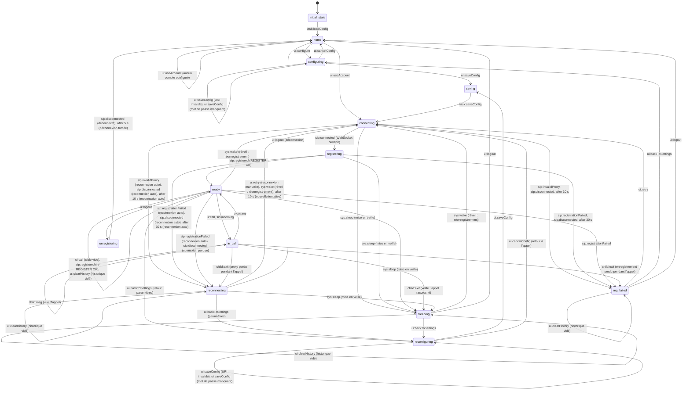
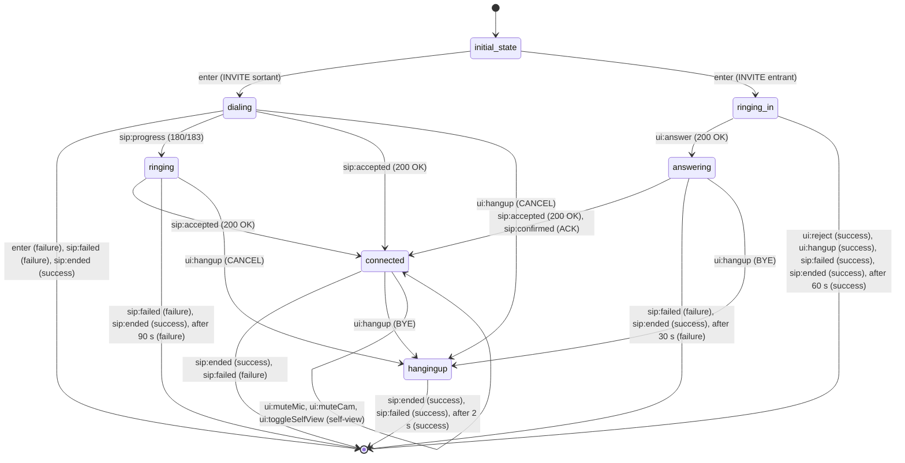

# Diagrammes des machines — générés, ne pas éditer

Régénérer avec `npm run diagrams`. Source : les `goto()` des machines,
extraits de `src/machines/` par `finite-state-language/diagram`.

Chaque flèche porte les événements qui la déclenchent, et entre parenthèses
le libellé de la transition. `[*]` est la fin de la machine. Les gardes
sont ignorées : une branche impossible à l'exécution est quand même
dessinée.

## PhoneMachine

Événements relayés à la machine enfant :

| État | Événements |
| --- | --- |
| `in_call` | `ui:hangup`, `ui:muteMic`, `ui:muteCam`, `ui:toggleSelfView`, `ui:answer`, `ui:reject`, `sip:disconnected`, `sys:sleep` |

Événements consommés sans effet sur cette machine :

| État | Événements |
| --- | --- |
| `home` | `sip:disconnected`, `sip:unregistered`, `sip:incoming`, `sys:sleep`, `sys:wake` |
| `configuring` | `sip:disconnected`, `sip:unregistered`, `sip:incoming`, `sys:sleep`, `sys:wake` |
| `reconfiguring` | `sip:disconnected`, `sip:unregistered`, `sip:incoming`, `sip:registrationFailed`, `sys:sleep`, `sys:wake` |
| `saving` | `sys:sleep`, `sys:wake` |
| `connecting` | `sip:incoming`, `sys:wake` |
| `registering` | `sip:incoming`, `sys:wake` |
| `ready` | `sip:connected` |
| `in_call` | `sip:incoming`, `ui:backToSettings`, `ui:logout`, `ui:call`, `sip:registered`, `sip:connected`, `sip:registrationFailed`, `sys:wake` |
| `reconnecting` | `ui:call`, `sip:disconnected`, `sip:unregistered`, `sip:incoming`, `sip:registrationFailed`, `sip:invalidProxy` |
| `sleeping` | `sys:sleep`, `ui:call`, `sip:disconnected`, `sip:unregistered`, `sip:incoming`, `sip:registrationFailed` |
| `reg_failed` | `sip:disconnected`, `sip:unregistered`, `sip:incoming`, `sip:registrationFailed`, `sip:invalidProxy`, `sys:sleep`, `sys:wake` |
| `unregistering` | `sip:unregistered`, `sip:registrationFailed`, `sip:incoming`, `sys:sleep`, `sys:wake` |

## CallMachine

Événements consommés sans effet sur cette machine :

| État | Événements |
| --- | --- |
| `dialing` | `parent:msg` |
| `ringing` | `sip:progress`, `parent:msg` |
| `ringing_in` | `parent:msg` |
| `answering` | `sip:progress`, `parent:msg` |
| `connected` | `sip:confirmed`, `sip:accepted`, `sip:progress`, `parent:msg` |
| `hangingup` | `sip:progress`, `sip:accepted`, `sip:confirmed`, `parent:msg` |
